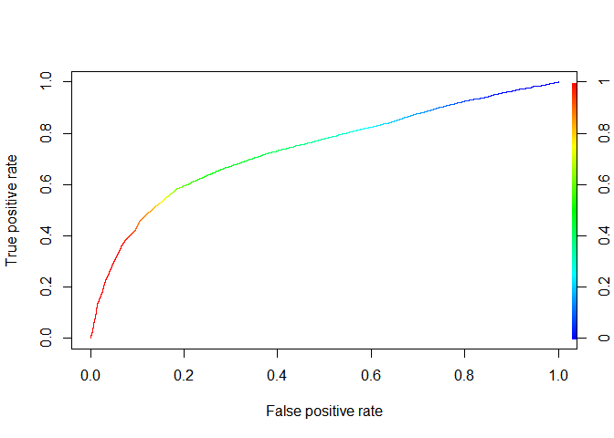

Ayudantia 10 Metodo Bayesiano
================

## Cargamos Librerias

``` r
library(tidyverse)
library(e1071)
library(caret)
library(rstan)
library(rstanarm)
library(titanic)
```

``` r
#rstan_options(auto_write=TRUE)
# Run on multiple cores
#options(mc.cores = parallel::detectCores())
```

## Cargamos los datos con los que vamos a trabajar

``` r
library(readr)
credito <- read_csv("C:/Users/josev/Desktop/Ayudantias/Ayudantia 10/UCI_Credit_Card.csv")
```

    ## 
    ## -- Column specification --------------------------------------------------------
    ## cols(
    ##   .default = col_double()
    ## )
    ## i Use `spec()` for the full column specifications.

``` r
View(credito)
```

``` r
glimpse(credito)
```

    ## Rows: 30,000
    ## Columns: 25
    ## $ ID                         <dbl> 1, 2, 3, 4, 5, 6, 7, 8, 9, 10, 11, 12, 13, ~
    ## $ LIMIT_BAL                  <dbl> 20000, 120000, 90000, 50000, 50000, 50000, ~
    ## $ SEX                        <dbl> 2, 2, 2, 2, 1, 1, 1, 2, 2, 1, 2, 2, 2, 1, 1~
    ## $ EDUCATION                  <dbl> 2, 2, 2, 2, 2, 1, 1, 2, 3, 3, 3, 1, 2, 2, 1~
    ## $ MARRIAGE                   <dbl> 1, 2, 2, 1, 1, 2, 2, 2, 1, 2, 2, 2, 2, 2, 2~
    ## $ AGE                        <dbl> 24, 26, 34, 37, 57, 37, 29, 23, 28, 35, 34,~
    ## $ PAY_0                      <dbl> 2, -1, 0, 0, -1, 0, 0, 0, 0, -2, 0, -1, -1,~
    ## $ PAY_2                      <dbl> 2, 2, 0, 0, 0, 0, 0, -1, 0, -2, 0, -1, 0, 2~
    ## $ PAY_3                      <dbl> -1, 0, 0, 0, -1, 0, 0, -1, 2, -2, 2, -1, -1~
    ## $ PAY_4                      <dbl> -1, 0, 0, 0, 0, 0, 0, 0, 0, -2, 0, -1, -1, ~
    ## $ PAY_5                      <dbl> -2, 0, 0, 0, 0, 0, 0, 0, 0, -1, 0, -1, -1, ~
    ## $ PAY_6                      <dbl> -2, 2, 0, 0, 0, 0, 0, -1, 0, -1, -1, 2, -1,~
    ## $ BILL_AMT1                  <dbl> 3913, 2682, 29239, 46990, 8617, 64400, 3679~
    ## $ BILL_AMT2                  <dbl> 3102, 1725, 14027, 48233, 5670, 57069, 4120~
    ## $ BILL_AMT3                  <dbl> 689, 2682, 13559, 49291, 35835, 57608, 4450~
    ## $ BILL_AMT4                  <dbl> 0, 3272, 14331, 28314, 20940, 19394, 542653~
    ## $ BILL_AMT5                  <dbl> 0, 3455, 14948, 28959, 19146, 19619, 483003~
    ## $ BILL_AMT6                  <dbl> 0, 3261, 15549, 29547, 19131, 20024, 473944~
    ## $ PAY_AMT1                   <dbl> 0, 0, 1518, 2000, 2000, 2500, 55000, 380, 3~
    ## $ PAY_AMT2                   <dbl> 689, 1000, 1500, 2019, 36681, 1815, 40000, ~
    ## $ PAY_AMT3                   <dbl> 0, 1000, 1000, 1200, 10000, 657, 38000, 0, ~
    ## $ PAY_AMT4                   <dbl> 0, 1000, 1000, 1100, 9000, 1000, 20239, 581~
    ## $ PAY_AMT5                   <dbl> 0, 0, 1000, 1069, 689, 1000, 13750, 1687, 1~
    ## $ PAY_AMT6                   <dbl> 0, 2000, 5000, 1000, 679, 800, 13770, 1542,~
    ## $ default.payment.next.month <dbl> 1, 1, 0, 0, 0, 0, 0, 0, 0, 0, 0, 0, 0, 1, 0~

## Pre Procesamiento

Se considerarán todas las variables significativas para este
modelamiento, ya estan todas en formato numerico. Solo se analizará si
es que hay datos na.

``` r
credito = na.omit(credito)
dim(credito)
```

    ## [1] 30000    25

## Metodo Bayesiano

``` r
library("e1071")

CreditoLinear <- stan_glm(default.payment.next.month ~. , 
                          data = credito, family = gaussian)
```

    ## 
    ## SAMPLING FOR MODEL 'continuous' NOW (CHAIN 1).
    ## Chain 1: 
    ## Chain 1: Gradient evaluation took 0 seconds
    ## Chain 1: 1000 transitions using 10 leapfrog steps per transition would take 0 seconds.
    ## Chain 1: Adjust your expectations accordingly!
    ## Chain 1: 
    ## Chain 1: 
    ## Chain 1: Iteration:    1 / 2000 [  0%]  (Warmup)
    ## Chain 1: Iteration:  200 / 2000 [ 10%]  (Warmup)
    ## Chain 1: Iteration:  400 / 2000 [ 20%]  (Warmup)
    ## Chain 1: Iteration:  600 / 2000 [ 30%]  (Warmup)
    ## Chain 1: Iteration:  800 / 2000 [ 40%]  (Warmup)
    ## Chain 1: Iteration: 1000 / 2000 [ 50%]  (Warmup)
    ## Chain 1: Iteration: 1001 / 2000 [ 50%]  (Sampling)
    ## Chain 1: Iteration: 1200 / 2000 [ 60%]  (Sampling)
    ## Chain 1: Iteration: 1400 / 2000 [ 70%]  (Sampling)
    ## Chain 1: Iteration: 1600 / 2000 [ 80%]  (Sampling)
    ## Chain 1: Iteration: 1800 / 2000 [ 90%]  (Sampling)
    ## Chain 1: Iteration: 2000 / 2000 [100%]  (Sampling)
    ## Chain 1: 
    ## Chain 1:  Elapsed Time: 0.296 seconds (Warm-up)
    ## Chain 1:                3.63 seconds (Sampling)
    ## Chain 1:                3.926 seconds (Total)
    ## Chain 1: 
    ## 
    ## SAMPLING FOR MODEL 'continuous' NOW (CHAIN 2).
    ## Chain 2: 
    ## Chain 2: Gradient evaluation took 0 seconds
    ## Chain 2: 1000 transitions using 10 leapfrog steps per transition would take 0 seconds.
    ## Chain 2: Adjust your expectations accordingly!
    ## Chain 2: 
    ## Chain 2: 
    ## Chain 2: Iteration:    1 / 2000 [  0%]  (Warmup)
    ## Chain 2: Iteration:  200 / 2000 [ 10%]  (Warmup)
    ## Chain 2: Iteration:  400 / 2000 [ 20%]  (Warmup)
    ## Chain 2: Iteration:  600 / 2000 [ 30%]  (Warmup)
    ## Chain 2: Iteration:  800 / 2000 [ 40%]  (Warmup)
    ## Chain 2: Iteration: 1000 / 2000 [ 50%]  (Warmup)
    ## Chain 2: Iteration: 1001 / 2000 [ 50%]  (Sampling)
    ## Chain 2: Iteration: 1200 / 2000 [ 60%]  (Sampling)
    ## Chain 2: Iteration: 1400 / 2000 [ 70%]  (Sampling)
    ## Chain 2: Iteration: 1600 / 2000 [ 80%]  (Sampling)
    ## Chain 2: Iteration: 1800 / 2000 [ 90%]  (Sampling)
    ## Chain 2: Iteration: 2000 / 2000 [100%]  (Sampling)
    ## Chain 2: 
    ## Chain 2:  Elapsed Time: 0.324 seconds (Warm-up)
    ## Chain 2:                3.748 seconds (Sampling)
    ## Chain 2:                4.072 seconds (Total)
    ## Chain 2: 
    ## 
    ## SAMPLING FOR MODEL 'continuous' NOW (CHAIN 3).
    ## Chain 3: 
    ## Chain 3: Gradient evaluation took 0 seconds
    ## Chain 3: 1000 transitions using 10 leapfrog steps per transition would take 0 seconds.
    ## Chain 3: Adjust your expectations accordingly!
    ## Chain 3: 
    ## Chain 3: 
    ## Chain 3: Iteration:    1 / 2000 [  0%]  (Warmup)
    ## Chain 3: Iteration:  200 / 2000 [ 10%]  (Warmup)
    ## Chain 3: Iteration:  400 / 2000 [ 20%]  (Warmup)
    ## Chain 3: Iteration:  600 / 2000 [ 30%]  (Warmup)
    ## Chain 3: Iteration:  800 / 2000 [ 40%]  (Warmup)
    ## Chain 3: Iteration: 1000 / 2000 [ 50%]  (Warmup)
    ## Chain 3: Iteration: 1001 / 2000 [ 50%]  (Sampling)
    ## Chain 3: Iteration: 1200 / 2000 [ 60%]  (Sampling)
    ## Chain 3: Iteration: 1400 / 2000 [ 70%]  (Sampling)
    ## Chain 3: Iteration: 1600 / 2000 [ 80%]  (Sampling)
    ## Chain 3: Iteration: 1800 / 2000 [ 90%]  (Sampling)
    ## Chain 3: Iteration: 2000 / 2000 [100%]  (Sampling)
    ## Chain 3: 
    ## Chain 3:  Elapsed Time: 0.56 seconds (Warm-up)
    ## Chain 3:                3.176 seconds (Sampling)
    ## Chain 3:                3.736 seconds (Total)
    ## Chain 3: 
    ## 
    ## SAMPLING FOR MODEL 'continuous' NOW (CHAIN 4).
    ## Chain 4: 
    ## Chain 4: Gradient evaluation took 0 seconds
    ## Chain 4: 1000 transitions using 10 leapfrog steps per transition would take 0 seconds.
    ## Chain 4: Adjust your expectations accordingly!
    ## Chain 4: 
    ## Chain 4: 
    ## Chain 4: Iteration:    1 / 2000 [  0%]  (Warmup)
    ## Chain 4: Iteration:  200 / 2000 [ 10%]  (Warmup)
    ## Chain 4: Iteration:  400 / 2000 [ 20%]  (Warmup)
    ## Chain 4: Iteration:  600 / 2000 [ 30%]  (Warmup)
    ## Chain 4: Iteration:  800 / 2000 [ 40%]  (Warmup)
    ## Chain 4: Iteration: 1000 / 2000 [ 50%]  (Warmup)
    ## Chain 4: Iteration: 1001 / 2000 [ 50%]  (Sampling)
    ## Chain 4: Iteration: 1200 / 2000 [ 60%]  (Sampling)
    ## Chain 4: Iteration: 1400 / 2000 [ 70%]  (Sampling)
    ## Chain 4: Iteration: 1600 / 2000 [ 80%]  (Sampling)
    ## Chain 4: Iteration: 1800 / 2000 [ 90%]  (Sampling)
    ## Chain 4: Iteration: 2000 / 2000 [100%]  (Sampling)
    ## Chain 4: 
    ## Chain 4:  Elapsed Time: 0.355 seconds (Warm-up)
    ## Chain 4:                2.655 seconds (Sampling)
    ## Chain 4:                3.01 seconds (Total)
    ## Chain 4:

``` r
model_nb <- naiveBayes(default.payment.next.month ~. , 
                          data = credito, laplace=1)
```

## Evaluacion Metodo Bayesiano

Si bien para el data set que se trabajo en esta ayudantia no es el
adecuado para poder realizar la evaluacion (ya que para el conjunto de
prueba del modelo no presenta la columna Survived para validar con la
matriz de confusion que tan bien se clasificaron las observaciones), en
forma general este modelo se evalua mediante la matriz de confusion,
donde se calcula el accuracy del modelo. Otro metodo de evaluacion
valido es graficar la curva ROC y calcular el AUC del modelo para saber
que tan bien esta clasificando nuestro modelo.

``` r
pred_nb <- predict(model_nb, newdata = credito)
credito$default.payment.next.month <- as.factor(credito$default.payment.next.month)
confusionMatrix(data=pred_nb, reference = credito$default.payment.next.month)
```

    ## Confusion Matrix and Statistics
    ## 
    ##           Reference
    ## Prediction     0     1
    ##          0 17180  2344
    ##          1  6184  4292
    ##                                           
    ##                Accuracy : 0.7157          
    ##                  95% CI : (0.7106, 0.7208)
    ##     No Information Rate : 0.7788          
    ##     P-Value [Acc > NIR] : 1               
    ##                                           
    ##                   Kappa : 0.3165          
    ##                                           
    ##  Mcnemar's Test P-Value : <2e-16          
    ##                                           
    ##             Sensitivity : 0.7353          
    ##             Specificity : 0.6468          
    ##          Pos Pred Value : 0.8799          
    ##          Neg Pred Value : 0.4097          
    ##              Prevalence : 0.7788          
    ##          Detection Rate : 0.5727          
    ##    Detection Prevalence : 0.6508          
    ##       Balanced Accuracy : 0.6910          
    ##                                           
    ##        'Positive' Class : 0               
    ## 

``` r
library(ROCR)

pred_test_nb <- predict(model_nb, newdata = credito, type="raw")
p_test_nb <- prediction(pred_test_nb[,2], credito$default.payment.next.month)
perf_nb <- performance(p_test_nb, "tpr", "fpr")
plot(perf_nb, colorize=T)
```

<!-- -->

``` r
performance(p_test_nb, "auc")@y.values
```

    ## [[1]]
    ## [1] 0.737399
