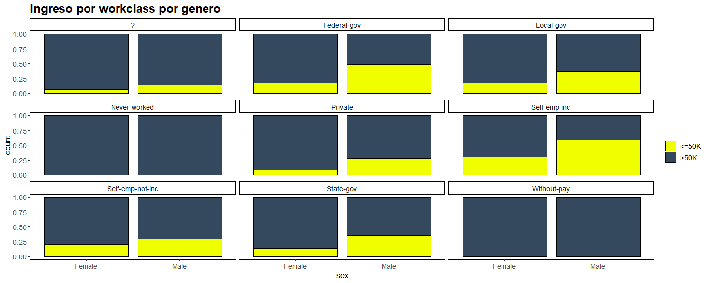
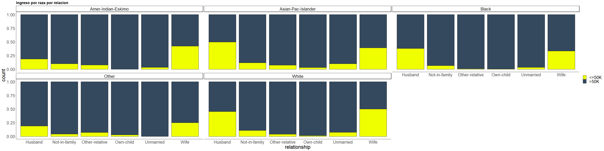
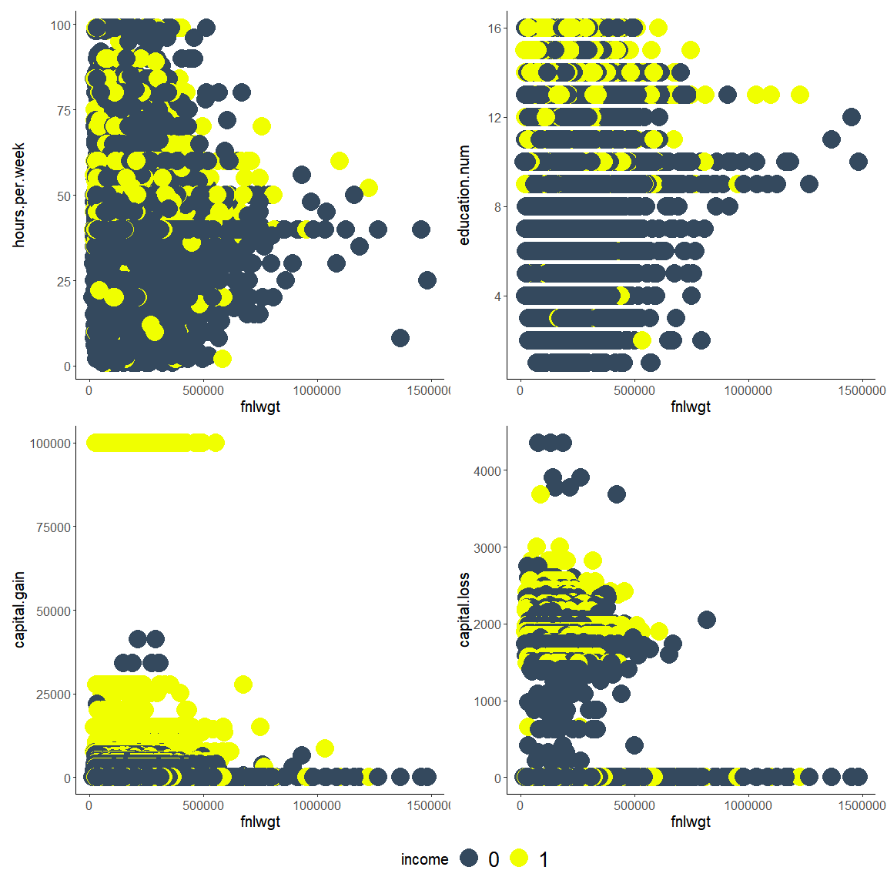

Ayudantia 11
================

## Arboles de Decision (modelo CART)

-   Algoritmo de aprendizaje automatico supervisado que se puede
    utilizar tanto para problemas de clasificacion como para problemas
    de regresion, por lo que tambien se lo conoce como modelo CART
    (arboles de clasificacion y regresion)

-   ¿Como funciona? La idea detras de los arboles de decision es
    realizar multiples divisiones en el conjunto de datos para tomar una
    decision

## Cargamos las librerias

``` r
library(plyr)
library(ggplot2)
library(tidyverse)
library(tidymodels)
library(discrim)
library(caret)
library(pROC)
```

## Cargamos los datos

``` r
library(readr)
adult <- read_csv("C:/Users/josev/Desktop/Ayudantias/Ayudantia 11/adult.csv")
```

    ## 
    ## -- Column specification --------------------------------------------------------
    ## cols(
    ##   age = col_double(),
    ##   workclass = col_character(),
    ##   fnlwgt = col_double(),
    ##   education = col_character(),
    ##   education.num = col_double(),
    ##   marital.status = col_character(),
    ##   occupation = col_character(),
    ##   relationship = col_character(),
    ##   race = col_character(),
    ##   sex = col_character(),
    ##   capital.gain = col_double(),
    ##   capital.loss = col_double(),
    ##   hours.per.week = col_double(),
    ##   native.country = col_character(),
    ##   income = col_character()
    ## )

``` r
head(adult)
```

    ## # A tibble: 6 x 15
    ##     age workclass fnlwgt education   education.num marital.status occupation    
    ##   <dbl> <chr>      <dbl> <chr>               <dbl> <chr>          <chr>         
    ## 1    90 ?          77053 HS-grad                 9 Widowed        ?             
    ## 2    82 Private   132870 HS-grad                 9 Widowed        Exec-manageri~
    ## 3    66 ?         186061 Some-colle~            10 Widowed        ?             
    ## 4    54 Private   140359 7th-8th                 4 Divorced       Machine-op-in~
    ## 5    41 Private   264663 Some-colle~            10 Separated      Prof-specialty
    ## 6    34 Private   216864 HS-grad                 9 Divorced       Other-service 
    ## # ... with 8 more variables: relationship <chr>, race <chr>, sex <chr>,
    ## #   capital.gain <dbl>, capital.loss <dbl>, hours.per.week <dbl>,
    ## #   native.country <chr>, income <chr>

``` r
summary(adult)
```

    ##       age         workclass             fnlwgt         education        
    ##  Min.   :17.00   Length:32561       Min.   :  12285   Length:32561      
    ##  1st Qu.:28.00   Class :character   1st Qu.: 117827   Class :character  
    ##  Median :37.00   Mode  :character   Median : 178356   Mode  :character  
    ##  Mean   :38.58                      Mean   : 189778                     
    ##  3rd Qu.:48.00                      3rd Qu.: 237051                     
    ##  Max.   :90.00                      Max.   :1484705                     
    ##  education.num   marital.status      occupation        relationship      
    ##  Min.   : 1.00   Length:32561       Length:32561       Length:32561      
    ##  1st Qu.: 9.00   Class :character   Class :character   Class :character  
    ##  Median :10.00   Mode  :character   Mode  :character   Mode  :character  
    ##  Mean   :10.08                                                           
    ##  3rd Qu.:12.00                                                           
    ##  Max.   :16.00                                                           
    ##      race               sex             capital.gain    capital.loss   
    ##  Length:32561       Length:32561       Min.   :    0   Min.   :   0.0  
    ##  Class :character   Class :character   1st Qu.:    0   1st Qu.:   0.0  
    ##  Mode  :character   Mode  :character   Median :    0   Median :   0.0  
    ##                                        Mean   : 1078   Mean   :  87.3  
    ##                                        3rd Qu.:    0   3rd Qu.:   0.0  
    ##                                        Max.   :99999   Max.   :4356.0  
    ##  hours.per.week  native.country        income         
    ##  Min.   : 1.00   Length:32561       Length:32561      
    ##  1st Qu.:40.00   Class :character   Class :character  
    ##  Median :40.00   Mode  :character   Mode  :character  
    ##  Mean   :40.44                                        
    ##  3rd Qu.:45.00                                        
    ##  Max.   :99.00

``` r
str(adult)
```

    ## spec_tbl_df [32,561 x 15] (S3: spec_tbl_df/tbl_df/tbl/data.frame)
    ##  $ age           : num [1:32561] 90 82 66 54 41 34 38 74 68 41 ...
    ##  $ workclass     : chr [1:32561] "?" "Private" "?" "Private" ...
    ##  $ fnlwgt        : num [1:32561] 77053 132870 186061 140359 264663 ...
    ##  $ education     : chr [1:32561] "HS-grad" "HS-grad" "Some-college" "7th-8th" ...
    ##  $ education.num : num [1:32561] 9 9 10 4 10 9 6 16 9 10 ...
    ##  $ marital.status: chr [1:32561] "Widowed" "Widowed" "Widowed" "Divorced" ...
    ##  $ occupation    : chr [1:32561] "?" "Exec-managerial" "?" "Machine-op-inspct" ...
    ##  $ relationship  : chr [1:32561] "Not-in-family" "Not-in-family" "Unmarried" "Unmarried" ...
    ##  $ race          : chr [1:32561] "White" "White" "Black" "White" ...
    ##  $ sex           : chr [1:32561] "Female" "Female" "Female" "Female" ...
    ##  $ capital.gain  : num [1:32561] 0 0 0 0 0 0 0 0 0 0 ...
    ##  $ capital.loss  : num [1:32561] 4356 4356 4356 3900 3900 ...
    ##  $ hours.per.week: num [1:32561] 40 18 40 40 40 45 40 20 40 60 ...
    ##  $ native.country: chr [1:32561] "United-States" "United-States" "United-States" "United-States" ...
    ##  $ income        : chr [1:32561] "<=50K" "<=50K" "<=50K" "<=50K" ...
    ##  - attr(*, "spec")=
    ##   .. cols(
    ##   ..   age = col_double(),
    ##   ..   workclass = col_character(),
    ##   ..   fnlwgt = col_double(),
    ##   ..   education = col_character(),
    ##   ..   education.num = col_double(),
    ##   ..   marital.status = col_character(),
    ##   ..   occupation = col_character(),
    ##   ..   relationship = col_character(),
    ##   ..   race = col_character(),
    ##   ..   sex = col_character(),
    ##   ..   capital.gain = col_double(),
    ##   ..   capital.loss = col_double(),
    ##   ..   hours.per.week = col_double(),
    ##   ..   native.country = col_character(),
    ##   ..   income = col_character()
    ##   .. )

## Transformamos la variable income

``` r
#Map 0 to 1 the adult feature
adult$income <- mapvalues(adult$income, from=c('>50K', '<=50K'), to=c(1,0))
```

``` r
adult %>% 
  summarise_all(funs(sum(is.na(.))))
```

    ## Warning: `funs()` was deprecated in dplyr 0.8.0.
    ## Please use a list of either functions or lambdas: 
    ## 
    ##   # Simple named list: 
    ##   list(mean = mean, median = median)
    ## 
    ##   # Auto named with `tibble::lst()`: 
    ##   tibble::lst(mean, median)
    ## 
    ##   # Using lambdas
    ##   list(~ mean(., trim = .2), ~ median(., na.rm = TRUE))

    ## # A tibble: 1 x 15
    ##     age workclass fnlwgt education education.num marital.status occupation
    ##   <int>     <int>  <int>     <int>         <int>          <int>      <int>
    ## 1     0         0      0         0             0              0          0
    ## # ... with 8 more variables: relationship <int>, race <int>, sex <int>,
    ## #   capital.gain <int>, capital.loss <int>, hours.per.week <int>,
    ## #   native.country <int>, income <int>

``` r
adult <- adult %>% filter(!(is.na(workclass))) %>% filter(!(is.na(occupation))) %>% filter(!(is.na(native.country)))

adult %>% 
  summarise_all(funs(sum(is.na(.))))
```

    ## # A tibble: 1 x 15
    ##     age workclass fnlwgt education education.num marital.status occupation
    ##   <int>     <int>  <int>     <int>         <int>          <int>      <int>
    ## 1     0         0      0         0             0              0          0
    ## # ... with 8 more variables: relationship <int>, race <int>, sex <int>,
    ## #   capital.gain <int>, capital.loss <int>, hours.per.week <int>,
    ## #   native.country <int>, income <int>

## Exploracion de los datos

``` r
table(adult$income)
```

    ## 
    ##     0     1 
    ## 24720  7841

``` r
target_count <- ggplot(adult, aes(x = income)) + 
geom_bar(color="black",width = 0.9) +
coord_flip() + 
theme_classic() +
theme(text=element_text(size = 15,  family="sans")) + 
theme(legend.position = "none") + 
scale_y_continuous(name = " ", limits = c(0,24000)) + 
ggtitle("Count Plot") + 
theme(plot.title = element_text(size = 20, face = "bold"))

target_count
```

    ## Warning: Removed 1 rows containing missing values (geom_bar).

<!-- -->

``` r
table(adult$workclass)
```

    ## 
    ##                ?      Federal-gov        Local-gov     Never-worked 
    ##             1836              960             2093                7 
    ##          Private     Self-emp-inc Self-emp-not-inc        State-gov 
    ##            22696             1116             2541             1298 
    ##      Without-pay 
    ##               14

``` r
plot1 <- ggplot(adult, aes(x = sex, fill = income)) + 
scale_fill_manual(name = " ", labels = c("<=50K", ">50K"), values = c("1" = "#F0FF00","0"="#34495E")) +
geom_bar(color="black",position="fill") + #black outline of the bars
facet_wrap(factor(workclass) ~ .) +
#coord_flip() + #flip the axes
theme_classic() + #classic theme for cleaner look
theme(text=element_text(size=13,  family="sans")) + #Font change to sans
theme(legend.position = "right") + 
#scale_y_discrete(name = " ", limits = c("Federal-gov","Female")) +
#scale_x_discrete(name = " ", limits = c("F", "M")) +
ggtitle("Ingreso por workclass por genero") + #axis name and order of labels
theme(plot.title = element_text(size = 18, family="sans", face = "bold"))

plot1
```

<!-- -->

``` r
plot2 <- ggplot(adult, aes(x = relationship, fill = income)) + 
scale_fill_manual(name = " ", labels = c("<=50K", ">50K"), values = c("1" = "#F0FF00","0"="#34495E")) +
geom_bar(color="black",position="fill") + #black outline of the bars
facet_wrap(factor(race) ~ .) +
#coord_flip() + #flip the axes
theme_classic() + #classic theme for cleaner look
theme(text=element_text(size=25,  family="sans")) + #Font change to sans
theme(legend.position = "right") + 
#scale_y_discrete(name = " ", limits = c("Federal-gov","Female")) +
#scale_x_discrete(name = " ", limits = c("F", "M")) +
ggtitle("Ingreso por raza por relacion") + #axis name and order of labels
theme(plot.title = element_text(size = 18, family="sans", face = "bold"))

plot2
```

<!-- -->

``` r
library(patchwork)

plot3 <- ggplot(adult,aes(fnlwgt, hours.per.week, color=income)) + 
  geom_point(size = 8) + 
  scale_color_manual(values = c('#34495E','#F0FF00')) + 
  theme(legend.position = "bottom") +
  theme_classic() +
  theme(text=element_text(size=15,  family="sans"))

plot4 <- ggplot(adult,aes(fnlwgt, education.num, color=income)) + 
  geom_point(size = 8) + 
  scale_color_manual(values = c('#34495E','#F0FF00')) + 
  theme(legend.position = "bottom") +
  theme_classic() +
  theme(text=element_text(size=15,  family="sans"))

plot5 <- ggplot(adult,aes(fnlwgt, capital.gain, color=income)) + 
  geom_point(size = 8) + 
  scale_color_manual(values = c('#34495E','#F0FF00')) + 
  theme(legend.position = "bottom") +
  theme_classic() +
  theme(text=element_text(size=15,  family="sans"))

plot6 <- ggplot(adult,aes(fnlwgt, capital.loss, color=income)) + 
  geom_point(size = 8) + 
  scale_color_manual(values = c('#34495E','#F0FF00')) + 
  theme(legend.position = "bottom") +
  theme_classic() +
  theme(text=element_text(size=15,  family="sans"))


combined <- plot3 + plot4 + plot5 + plot6 & theme(legend.position = "bottom") + theme(legend.text=element_text(size=20))
combined + plot_layout(guides = "collect")
```

<!-- -->

## Implementacion Decision Trees, separar data en Test y Train

``` r
library(tidymodels)

data_split <- initial_split(adult, prop = 0.8)

# Create data frames for the two sets:
train_data <- training(data_split) 
test_data <- testing(data_split)

str(train_data)
```

    ## tibble [26,048 x 15] (S3: tbl_df/tbl/data.frame)
    ##  $ age           : num [1:26048] 34 45 43 45 38 60 46 52 51 61 ...
    ##  $ workclass     : chr [1:26048] "Private" "Self-emp-not-inc" "Private" "Private" ...
    ##  $ fnlwgt        : num [1:26048] 167781 188694 212894 38950 140854 ...
    ##  $ education     : chr [1:26048] "HS-grad" "HS-grad" "Some-college" "Bachelors" ...
    ##  $ education.num : num [1:26048] 9 9 10 13 13 7 14 9 9 9 ...
    ##  $ marital.status: chr [1:26048] "Married-civ-spouse" "Married-civ-spouse" "Married-civ-spouse" "Never-married" ...
    ##  $ occupation    : chr [1:26048] "Other-service" "Exec-managerial" "Craft-repair" "Craft-repair" ...
    ##  $ relationship  : chr [1:26048] "Husband" "Husband" "Husband" "Not-in-family" ...
    ##  $ race          : chr [1:26048] "White" "White" "White" "White" ...
    ##  $ sex           : chr [1:26048] "Male" "Male" "Male" "Male" ...
    ##  $ capital.gain  : num [1:26048] 0 0 0 0 0 0 0 0 0 0 ...
    ##  $ capital.loss  : num [1:26048] 0 0 0 0 0 0 0 0 0 0 ...
    ##  $ hours.per.week: num [1:26048] 50 40 40 40 40 20 45 40 81 40 ...
    ##  $ native.country: chr [1:26048] "United-States" "United-States" "United-States" "United-States" ...
    ##  $ income        : chr [1:26048] "0" "0" "0" "0" ...

``` r
str(test_data)
```

    ## tibble [6,513 x 15] (S3: tbl_df/tbl/data.frame)
    ##  $ age           : num [1:6513] 34 41 38 45 29 37 51 60 51 48 ...
    ##  $ workclass     : chr [1:6513] "Private" "Private" "Self-emp-not-inc" "Private" ...
    ##  $ fnlwgt        : num [1:6513] 216864 70037 164526 172822 77009 ...
    ##  $ education     : chr [1:6513] "HS-grad" "Some-college" "Prof-school" "11th" ...
    ##  $ education.num : num [1:6513] 9 10 15 7 7 6 13 9 10 13 ...
    ##  $ marital.status: chr [1:6513] "Divorced" "Never-married" "Never-married" "Divorced" ...
    ##  $ occupation    : chr [1:6513] "Other-service" "Craft-repair" "Prof-specialty" "Transport-moving" ...
    ##  $ relationship  : chr [1:6513] "Unmarried" "Unmarried" "Not-in-family" "Not-in-family" ...
    ##  $ race          : chr [1:6513] "White" "White" "White" "White" ...
    ##  $ sex           : chr [1:6513] "Female" "Male" "Male" "Male" ...
    ##  $ capital.gain  : num [1:6513] 0 0 0 0 0 0 0 0 0 0 ...
    ##  $ capital.loss  : num [1:6513] 3770 3004 2824 2824 2754 ...
    ##  $ hours.per.week: num [1:6513] 45 60 45 76 42 50 50 50 40 70 ...
    ##  $ native.country: chr [1:6513] "United-States" "?" "United-States" "United-States" ...
    ##  $ income        : chr [1:6513] "0" "1" "1" "1" ...

## Seleccion de Atributos

-   Si lo pensamos bien, marital.status y relationship son atributos que
    estan algo relacionadas. Lo mismo ocurre con education.num y
    education. Ademas hay atributos que no tienen mucha importancia para
    el analisis que tambien eliminaremos.

``` r
train <- subset(train_data, select = - c(relationship, education.num, race, native.country, capital.loss, fnlwgt, hours.per.week, workclass))
test <- subset(test_data, select = - c(relationship, education.num, race, native.country, capital.loss, fnlwgt, hours.per.week, workclass))
```

``` r
library(rpart)
```

    ## 
    ## Attaching package: 'rpart'

    ## The following object is masked from 'package:dials':
    ## 
    ##     prune

``` r
library(rpart.plot)

censo <- rpart(income~., data = train, method = "class")

rpart.plot(censo)
```

<!-- -->

## Predict

``` r
pred_income <- predict(censo, newdata = test, type = "class")
pred_income %>% as.data.frame() %>% head()
```

    ##   .
    ## 1 0
    ## 2 0
    ## 3 0
    ## 4 0
    ## 5 0
    ## 6 0

``` r
pred_income %>% as.data.frame() %>% tail()
```

    ##      .
    ## 6508 0
    ## 6509 0
    ## 6510 0
    ## 6511 0
    ## 6512 0
    ## 6513 0

``` r
test_data$predictedincome <- pred_income
```

``` r
## Prob para curva ROC

pred_incom_roc <- predict(censo, newdata = test, type = "prob")
pred_incom_roc %>% as.data.frame() %>% head()
```

    ##           0          1
    ## 1 0.9510728 0.04892723
    ## 2 0.9510728 0.04892723
    ## 3 0.9510728 0.04892723
    ## 4 0.9510728 0.04892723
    ## 5 0.9510728 0.04892723
    ## 6 0.9510728 0.04892723

``` r
pred_incom_roc %>% as.data.frame() %>% tail()
```

    ##              0          1
    ## 6508 0.9510728 0.04892723
    ## 6509 0.7073507 0.29264927
    ## 6510 0.9510728 0.04892723
    ## 6511 0.9510728 0.04892723
    ## 6512 0.9510728 0.04892723
    ## 6513 0.7073507 0.29264927

``` r
pred_incom_roc <- pred_incom_roc %>% as.data.frame()
prob <- pred_incom_roc$"1"
```

## Curva ROC

``` r
ROC <- roc(test_data$income,prob)
```

    ## Setting levels: control = 0, case = 1

    ## Setting direction: controls < cases

``` r
plot(ROC, col = "#fd634b", family = "sans", cex = 2, main = "CART Model ROC Curve 
AUC = 0.8474")
```

<!-- -->

``` r
auc(ROC)
```

    ## Area under the curve: 0.8402

## Chequeo de Overfitting - Train vs Test Accuracy

``` r
is_predictedincome <- predict(censo,newdata=train_data,type='class')
misClassError <- mean(is_predictedincome != train_data$income)
print(paste('Train-set Accuracy =',1-misClassError))
```

    ## [1] "Train-set Accuracy = 0.845707923832924"

``` r
misClassError <- mean(test_data$predictedincome != test_data$income)
print(paste('Test-set Accuracy =',1-misClassError))
```

    ## [1] "Test-set Accuracy = 0.836480884385076"

-   Al observar los resultados del AUC y el accuracy del modelo, podemos
    concluir que el modelo CART hizo un buen trabajo de clasificacion.
    El accuracy del test y del train no estan my lejos una de la otra,
    lo que nos indica que el modelo no se supero.

-   Lo ultimo que veremos sera la optimizacion de hiperparametros para
    ver si podemos mejorar el resultado obtenido.

## Creando un modelo CART optimo: Tuneo Automatico

``` r
set.seed(823)
fitControl <- trainControl(method = "cv", number = 10,         
                      verboseIter = FALSE)


best_model <- train(income ~ ., data = train,            
                    method = "rpart",                     
                    trControl = fitControl,
                    tuneLength = 10)
best_model
```

    ## CART 
    ## 
    ## 26048 samples
    ##     6 predictor
    ##     2 classes: '0', '1' 
    ## 
    ## No pre-processing
    ## Resampling: Cross-Validated (10 fold) 
    ## Summary of sample sizes: 23443, 23443, 23444, 23444, 23443, 23443, ... 
    ## Resampling results across tuning parameters:
    ## 
    ##   cp           Accuracy   Kappa    
    ##   0.001805533  0.8472819  0.5498381
    ##   0.001911741  0.8465907  0.5486509
    ##   0.002708300  0.8451703  0.5441978
    ##   0.002947268  0.8450167  0.5441178
    ##   0.004938665  0.8447864  0.5434218
    ##   0.006053847  0.8432506  0.5427505
    ##   0.027242313  0.8386053  0.5174412
    ##   0.036960331  0.8325783  0.4795532
    ##   0.054962562  0.8200243  0.4156782
    ##   0.075354469  0.7792541  0.1441296
    ## 
    ## Accuracy was used to select the optimal model using the largest value.
    ## The final value used for the model was cp = 0.001805533.

``` r
best_model$bestTune
```

    ##            cp
    ## 1 0.001805533

## Predict

``` r
pred_income <- predict(best_model, newdata = test, type = "raw")
pred_income %>% as.data.frame() %>% head()
```

    ##   .
    ## 1 0
    ## 2 0
    ## 3 0
    ## 4 0
    ## 5 0
    ## 6 0

``` r
pred_income %>% as.data.frame() %>% tail()
```

    ##      .
    ## 6508 0
    ## 6509 0
    ## 6510 0
    ## 6511 0
    ## 6512 0
    ## 6513 0

``` r
test_data$predictedincome <- pred_income
```

``` r
## Prob para curva ROC

pred_incom_roc <- predict(best_model, newdata = test, type = "prob")
pred_incom_roc %>% as.data.frame() %>% head()
```

    ##           0          1
    ## 1 0.9508363 0.04916371
    ## 2 0.9508363 0.04916371
    ## 3 0.9508363 0.04916371
    ## 4 0.9508363 0.04916371
    ## 5 0.9508363 0.04916371
    ## 6 0.9508363 0.04916371

``` r
pred_incom_roc %>% as.data.frame() %>% tail()
```

    ##              0          1
    ## 6508 0.9508363 0.04916371
    ## 6509 0.7330420 0.26695797
    ## 6510 0.9508363 0.04916371
    ## 6511 0.9508363 0.04916371
    ## 6512 0.9508363 0.04916371
    ## 6513 0.7330420 0.26695797

``` r
pred_incom_roc <- pred_incom_roc %>% as.data.frame()
prob <- pred_incom_roc$"1"
```

## Curva ROC

``` r
library(pROC)

ROC <- roc(test_data$income,prob)
```

    ## Setting levels: control = 0, case = 1

    ## Setting direction: controls < cases

``` r
plot(ROC, col = "#fd634b", family = "sans", cex = 2, main = "CART Model ROC Curve 
AUC = 0.8648")
```

<!-- -->

``` r
auc(ROC)
```

    ## Area under the curve: 0.8583
