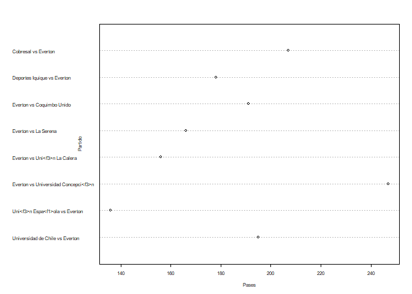
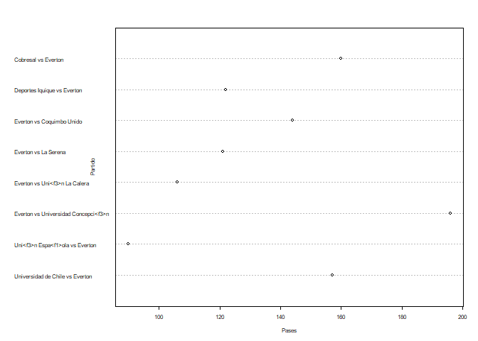
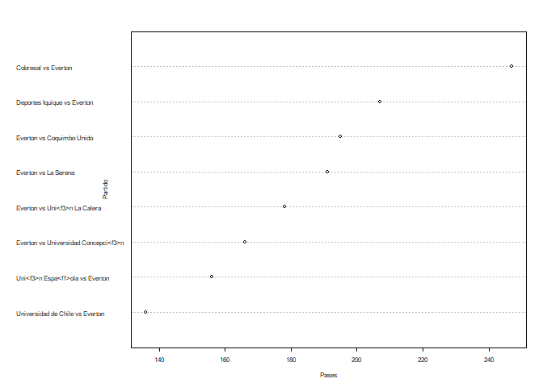
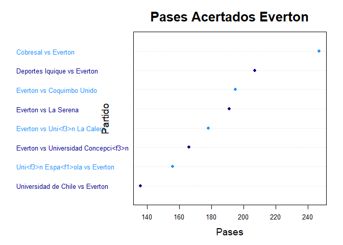

Ayudantia 2
================

## Librerias

``` r
library(quanteda)
```

    ## Warning: package 'quanteda' was built under R version 3.6.3

    ## Package version: 3.0.0
    ## Unicode version: 10.0
    ## ICU version: 61.1

    ## Parallel computing: 8 of 8 threads used.

    ## See https://quanteda.io for tutorials and examples.

``` r
library(dplyr)
```

    ## Warning: package 'dplyr' was built under R version 3.6.3

    ## 
    ## Attaching package: 'dplyr'

    ## The following objects are masked from 'package:stats':
    ## 
    ##     filter, lag

    ## The following objects are masked from 'package:base':
    ## 
    ##     intersect, setdiff, setequal, union

``` r
library(tidyverse)
```

    ## Warning: package 'tidyverse' was built under R version 3.6.3

    ## -- Attaching packages --------------------------------------- tidyverse 1.3.1 --

    ## v ggplot2 3.3.3     v purrr   0.3.4
    ## v tibble  3.1.1     v stringr 1.4.0
    ## v tidyr   1.1.3     v forcats 0.5.1
    ## v readr   1.4.0

    ## Warning: package 'ggplot2' was built under R version 3.6.3

    ## Warning: package 'tibble' was built under R version 3.6.3

    ## Warning: package 'tidyr' was built under R version 3.6.3

    ## Warning: package 'readr' was built under R version 3.6.3

    ## Warning: package 'purrr' was built under R version 3.6.3

    ## Warning: package 'forcats' was built under R version 3.6.3

    ## -- Conflicts ------------------------------------------ tidyverse_conflicts() --
    ## x dplyr::filter() masks stats::filter()
    ## x dplyr::lag()    masks stats::lag()

``` r
library(utf8)
library(ggplot2)
```

Leer base de datos

``` r
primer_tiempo2020 <- read_csv("Primer_Tiempo2020.csv")
```

    ## 
    ## -- Column specification --------------------------------------------------------
    ## cols(
    ##   .default = col_double(),
    ##   torneo = col_character(),
    ##   equipo = col_character(),
    ##   id_partido = col_character(),
    ##   partido = col_character(),
    ##   fasepartido = col_character(),
    ##   local = col_logical(),
    ##   tiempo = col_character()
    ## )
    ## i Use `spec()` for the full column specifications.

## Borrar variables tipo char

``` r
primer_tiempo2020
```

    ## # A tibble: 130 x 49
    ##    torneo   equipo   id_partido  partido   fasepartido local tiempo accuratePass
    ##    <chr>    <chr>    <chr>       <chr>     <chr>       <lgl> <chr>         <dbl>
    ##  1 Primera~ Uni<f3>~ 6xszsf73jq~ Universi~ Regular Se~ FALSE fh              235
    ##  2 Primera~ Univers~ 6xszsf73jq~ Universi~ Regular Se~ TRUE  fh              199
    ##  3 Primera~ Everton  e88gat05jr~ Universi~ Regular Se~ FALSE fh              157
    ##  4 Primera~ Univers~ e88gat05jr~ Universi~ Regular Se~ TRUE  fh              192
    ##  5 Primera~ Curic<f~ 35ijq76er8~ Universi~ Regular Se~ FALSE fh              142
    ##  6 Primera~ Univers~ 35ijq76er8~ Universi~ Regular Se~ TRUE  fh              168
    ##  7 Primera~ Coquimb~ 9o9ji2f68p~ Universi~ Regular Se~ FALSE fh              190
    ##  8 Primera~ Univers~ 9o9ji2f68p~ Universi~ Regular Se~ TRUE  fh              200
    ##  9 Primera~ Santiag~ 357wqv3701~ Universi~ Regular Se~ FALSE fh              156
    ## 10 Primera~ Univers~ 357wqv3701~ Universi~ Regular Se~ TRUE  fh               92
    ## # ... with 120 more rows, and 41 more variables: wonTackle <dbl>,
    ## #   lostCorners <dbl>, goalsConceded <dbl>, saves <dbl>,
    ## #   ontargetScoringAtt <dbl>, totalScoringAtt <dbl>, subsMade <dbl>,
    ## #   totalThrows <dbl>, totalYellowCard <dbl>, goalKicks <dbl>, totalPass <dbl>,
    ## #   fkFoulWon <dbl>, totalTackle <dbl>, fkFoulLost <dbl>,
    ## #   possessionPercentage <dbl>, totalClearance <dbl>, formationUsed <dbl>,
    ## #   blockedScoringAtt <dbl>, goalAssist <dbl>, goals <dbl>, totalOffside <dbl>,
    ## #   shotOffTarget <dbl>, wonCorners <dbl>, cornerTaken <dbl>,
    ## #   penaltyConceded <dbl>, penaltyFaced <dbl>, penGoalsConceded <dbl>,
    ## #   penaltyWon <dbl>, ownGoals <dbl>, penaltySave <dbl>, secondYellow <dbl>,
    ## #   totalRedCard <dbl>, posesion_Rival <dbl>, precision_pases <dbl>,
    ## #   precision_tiros <dbl>, minutos_juego <dbl>, minutos_juegorival <dbl>,
    ## #   golesSalvados <dbl>, foulsInofensivos <dbl>, cortarJuegoContrario <dbl>,
    ## #   juegoCortado <dbl>

``` r
primer_tiempo2020 <- primer_tiempo2020[,!(colnames(primer_tiempo2020) %in% c("id_partido", "fasepartido", "local", "tiempo","formationUsed", "torneo"))]
primer_tiempo2020
```

    ## # A tibble: 130 x 43
    ##    equipo    partido      accuratePass wonTackle lostCorners goalsConceded saves
    ##    <chr>     <chr>               <dbl>     <dbl>       <dbl>         <dbl> <dbl>
    ##  1 Uni<f3>n~ Universidad~          235         2           3             1     4
    ##  2 Universi~ Universidad~          199         2           0             0     1
    ##  3 Everton   Universidad~          157         7           6             0     3
    ##  4 Universi~ Universidad~          192         4           1             0     2
    ##  5 Curic<f3~ Universidad~          142         6           3             2     2
    ##  6 Universi~ Universidad~          168         8           1             1     2
    ##  7 Coquimbo~ Universidad~          190         3           0             0     2
    ##  8 Universi~ Universidad~          200         5           0             0     0
    ##  9 Santiago~ Universidad~          156         4           3             0     0
    ## 10 Universi~ Universidad~           92         4           1             1     1
    ## # ... with 120 more rows, and 36 more variables: ontargetScoringAtt <dbl>,
    ## #   totalScoringAtt <dbl>, subsMade <dbl>, totalThrows <dbl>,
    ## #   totalYellowCard <dbl>, goalKicks <dbl>, totalPass <dbl>, fkFoulWon <dbl>,
    ## #   totalTackle <dbl>, fkFoulLost <dbl>, possessionPercentage <dbl>,
    ## #   totalClearance <dbl>, blockedScoringAtt <dbl>, goalAssist <dbl>,
    ## #   goals <dbl>, totalOffside <dbl>, shotOffTarget <dbl>, wonCorners <dbl>,
    ## #   cornerTaken <dbl>, penaltyConceded <dbl>, penaltyFaced <dbl>,
    ## #   penGoalsConceded <dbl>, penaltyWon <dbl>, ownGoals <dbl>,
    ## #   penaltySave <dbl>, secondYellow <dbl>, totalRedCard <dbl>,
    ## #   posesion_Rival <dbl>, precision_pases <dbl>, precision_tiros <dbl>,
    ## #   minutos_juego <dbl>, minutos_juegorival <dbl>, golesSalvados <dbl>,
    ## #   foulsInofensivos <dbl>, cortarJuegoContrario <dbl>, juegoCortado <dbl>

``` r
str(primer_tiempo2020)
```

    ## tibble [130 x 43] (S3: tbl_df/tbl/data.frame)
    ##  $ equipo              : chr [1:130] "Uni<f3>n La Calera" "Universidad de Chile" "Everton" "Universidad de Chile" ...
    ##  $ partido             : chr [1:130] "Universidad de Chile vs Uni<f3>n La Calera" "Universidad de Chile vs Uni<f3>n La Calera" "Universidad de Chile vs Everton" "Universidad de Chile vs Everton" ...
    ##  $ accuratePass        : num [1:130] 235 199 157 192 142 168 190 200 156 92 ...
    ##  $ wonTackle           : num [1:130] 2 2 7 4 6 8 3 5 4 4 ...
    ##  $ lostCorners         : num [1:130] 3 0 6 1 3 1 0 0 3 1 ...
    ##  $ goalsConceded       : num [1:130] 1 0 0 0 2 1 0 0 0 1 ...
    ##  $ saves               : num [1:130] 4 1 3 2 2 2 2 0 0 1 ...
    ##  $ ontargetScoringAtt  : num [1:130] 1 5 2 3 2 4 0 2 2 0 ...
    ##  $ totalScoringAtt     : num [1:130] 3 9 5 9 4 7 1 4 7 1 ...
    ##  $ subsMade            : num [1:130] 0 0 0 0 0 0 0 0 0 1 ...
    ##  $ totalThrows         : num [1:130] 6 8 9 12 17 9 13 11 11 15 ...
    ##  $ totalYellowCard     : num [1:130] 1 0 2 1 0 0 1 0 0 1 ...
    ##  $ goalKicks           : num [1:130] 3 2 2 3 6 4 1 3 4 5 ...
    ##  $ totalPass           : num [1:130] 271 235 195 225 181 202 236 245 216 150 ...
    ##  $ fkFoulWon           : num [1:130] 2 7 6 5 5 10 5 10 7 7 ...
    ##  $ totalTackle         : num [1:130] 3 3 12 6 8 12 5 6 6 5 ...
    ##  $ fkFoulLost          : num [1:130] 7 2 9 6 11 5 10 6 7 7 ...
    ##  $ possessionPercentage: num [1:130] 53.4 46.6 45.7 54.3 47 53 49.5 50.5 58.4 41.6 ...
    ##  $ totalClearance      : num [1:130] 6 2 13 4 6 7 3 4 6 5 ...
    ##  $ blockedScoringAtt   : num [1:130] 1 0 1 4 0 1 0 1 0 1 ...
    ##  $ goalAssist          : num [1:130] 0 1 0 0 1 2 0 0 0 0 ...
    ##  $ goals               : num [1:130] 0 1 0 0 1 2 0 0 1 0 ...
    ##  $ totalOffside        : num [1:130] 0 2 3 0 0 2 0 3 0 0 ...
    ##  $ shotOffTarget       : num [1:130] 1 4 2 2 2 2 1 1 5 0 ...
    ##  $ wonCorners          : num [1:130] 0 3 1 6 1 3 0 0 1 3 ...
    ##  $ cornerTaken         : num [1:130] 0 3 1 6 1 3 0 0 1 3 ...
    ##  $ penaltyConceded     : num [1:130] 0 0 0 0 0 0 0 0 0 0 ...
    ##  $ penaltyFaced        : num [1:130] 0 0 0 0 0 0 0 0 0 0 ...
    ##  $ penGoalsConceded    : num [1:130] 0 0 0 0 0 0 0 0 0 0 ...
    ##  $ penaltyWon          : num [1:130] 0 0 0 0 0 0 0 0 0 0 ...
    ##  $ ownGoals            : num [1:130] 0 0 0 0 0 0 0 0 0 0 ...
    ##  $ penaltySave         : num [1:130] 0 0 0 0 0 0 0 0 0 0 ...
    ##  $ secondYellow        : num [1:130] 0 0 0 0 0 0 0 0 0 0 ...
    ##  $ totalRedCard        : num [1:130] 0 0 0 0 0 0 0 0 0 0 ...
    ##  $ posesion_Rival      : num [1:130] 46.6 53.4 54.3 45.7 53 47 50.5 49.5 41.6 58.4 ...
    ##  $ precision_pases     : num [1:130] 86.7 84.7 80.5 85.3 78.5 ...
    ##  $ precision_tiros     : num [1:130] 33.3 60 40 33.3 60 ...
    ##  $ minutos_juego       : num [1:130] 24 21 20.6 24.4 21.1 ...
    ##  $ minutos_juegorival  : num [1:130] 21 24 24.4 20.6 23.9 ...
    ##  $ golesSalvados       : num [1:130] 4 1 3 2 2 2 2 0 0 1 ...
    ##  $ foulsInofensivos    : num [1:130] 6 2 7 5 11 5 9 6 7 6 ...
    ##  $ cortarJuegoContrario: num [1:130] 9 4 16 10 17 13 13 11 11 11 ...
    ##  $ juegoCortado        : num [1:130] 8 20 19 23 23 24 18 24 19 25 ...

## Analisis descriptivo

### Ordenamos el data frame segun pases acertados en orden decreciente

``` r
fh2020 <- primer_tiempo2020[order(primer_tiempo2020$accuratePass, decreasing = TRUE),]
fh2020
```

    ## # A tibble: 130 x 43
    ##    equipo    partido      accuratePass wonTackle lostCorners goalsConceded saves
    ##    <chr>     <chr>               <dbl>     <dbl>       <dbl>         <dbl> <dbl>
    ##  1 Universi~ Universidad~          269         2           3             0     2
    ##  2 Deportiv~ Deportivo A~          253        11           1             1     1
    ##  3 Uni<f3>n~ Uni<f3>n La~          252         6           3             1     3
    ##  4 Curic<f3~ Universidad~          245         5           2             0     2
    ##  5 Uni<f3>n~ Uni<f3>n La~          237         5           2             0     0
    ##  6 Uni<f3>n~ Universidad~          235         2           3             1     4
    ##  7 Colo Colo Colo Colo v~          231         4           0             0     0
    ##  8 Uni<f3>n~ Uni<f3>n Es~          224         7           0             1     0
    ##  9 Audax It~ Audax Itali~          220         2           1             1     1
    ## 10 Audax It~ Audax Itali~          219         6           1             0     0
    ## # ... with 120 more rows, and 36 more variables: ontargetScoringAtt <dbl>,
    ## #   totalScoringAtt <dbl>, subsMade <dbl>, totalThrows <dbl>,
    ## #   totalYellowCard <dbl>, goalKicks <dbl>, totalPass <dbl>, fkFoulWon <dbl>,
    ## #   totalTackle <dbl>, fkFoulLost <dbl>, possessionPercentage <dbl>,
    ## #   totalClearance <dbl>, blockedScoringAtt <dbl>, goalAssist <dbl>,
    ## #   goals <dbl>, totalOffside <dbl>, shotOffTarget <dbl>, wonCorners <dbl>,
    ## #   cornerTaken <dbl>, penaltyConceded <dbl>, penaltyFaced <dbl>,
    ## #   penGoalsConceded <dbl>, penaltyWon <dbl>, ownGoals <dbl>,
    ## #   penaltySave <dbl>, secondYellow <dbl>, totalRedCard <dbl>,
    ## #   posesion_Rival <dbl>, precision_pases <dbl>, precision_tiros <dbl>,
    ## #   minutos_juego <dbl>, minutos_juegorival <dbl>, golesSalvados <dbl>,
    ## #   foulsInofensivos <dbl>, cortarJuegoContrario <dbl>, juegoCortado <dbl>

## Sub Dataframes

``` r
fh2020_pases = fh2020[,colnames(primer_tiempo2020) %in% c("equipo", "partido", "accuratePass", "totalPass", "precision_pases")]
fh2020_pases = fh2020_pases[order(fh2020_pases$precision_pases, decreasing = TRUE),]
fh2020_pases
```

    ## # A tibble: 130 x 5
    ##    equipo        partido                  accuratePass totalPass precision_pases
    ##    <chr>         <chr>                           <dbl>     <dbl>           <dbl>
    ##  1 Audax Italia~ Audax Italiano vs Cobre~          220       246            89.4
    ##  2 Universidad ~ Universidad Cat<f3>lica~          269       304            88.5
    ##  3 Uni<f3>n La ~ Uni<f3>n La Calera vs L~          252       285            88.4
    ##  4 Deportivo An~ Deportivo Antofagasta v~          253       289            87.5
    ##  5 Uni<f3>n La ~ Universidad de Chile vs~          235       271            86.7
    ##  6 Universidad ~ Huachipato vs Universid~          202       233            86.7
    ##  7 Colo Colo     Colo Colo vs Universida~          231       267            86.5
    ##  8 Deportivo An~ Deportivo Antofagasta v~          162       188            86.2
    ##  9 Universidad ~ Deportivo Antofagasta v~          202       235            86.0
    ## 10 Uni<f3>n La ~ Uni<f3>n La Calera vs U~          176       205            85.9
    ## # ... with 120 more rows

``` r
fh2020_tiros <- NULL
fh2020_tiros = fh2020[,colnames(primer_tiempo2020) %in% c("equipo", "partido", "goals", "ontargetScoringAtt", "totalScoringAtt", "blockedScoringAtt", "shotOffTarget", "precision_tiros")]
fh2020_tiros = fh2020_tiros[order(fh2020_tiros$goals, decreasing = TRUE),]
fh2020_tiros
```

    ## # A tibble: 130 x 8
    ##    equipo   partido      ontargetScoring~ totalScoringAtt blockedScoringA~ goals
    ##    <chr>    <chr>                   <dbl>           <dbl>            <dbl> <dbl>
    ##  1 Uni<f3>~ Uni<f3>n Es~                4               5                0     3
    ##  2 Univers~ Universidad~                3               8                2     2
    ##  3 Colo Co~ Colo Colo v~                4              10                2     2
    ##  4 Audax I~ Audax Itali~                3               9                2     2
    ##  5 Univers~ Deportivo A~                5               9                2     2
    ##  6 Univers~ Universidad~                4               7                1     2
    ##  7 Deporti~ Deportivo A~                5              14                4     2
    ##  8 Uni<f3>~ O'Higgins v~                3               4                1     2
    ##  9 Deporte~ Deportes Iq~                2               7                2     2
    ## 10 La Sere~ La Serena v~                4               7                1     2
    ## # ... with 120 more rows, and 2 more variables: shotOffTarget <dbl>,
    ## #   precision_tiros <dbl>

## Hacemos un filtro segun equipo, en este caso “Everton”

``` r
everton <- filter(primer_tiempo2020, equipo == "Everton")
everton_tiros <- filter(fh2020_tiros, equipo == "Everton")
everton_pases <- filter(fh2020_pases, equipo == "Everton")
```

## Agregar Promedio/Suma Total/Min/

``` r
everton_pases <-everton_pases[,!(colnames(everton_pases) %in% c("equipo"))] 
Promedios_Pas <- c("Promedio Pases",mean(everton_pases$accuratePass),mean(everton_pases$totalPass),mean(everton_pases$precision_pases))
everton_pases <- rbind(everton_pases, Promedios_Pas)
Max_Pas <- c("Max Pases",max(everton_pases$accuratePass),max(everton_pases$totalPass),max(everton_pases$precision_pases))
everton_pases <- rbind(everton_pases, Max_Pas)
Min_Pas <- c("Min Pases",min(everton_pases$accuratePass),min(everton_pases$totalPass),min(everton_pases$precision_pases))
everton_pases <- rbind(everton_pases, Min_Pas)
everton_pases
```

    ## # A tibble: 11 x 4
    ##    partido                              accuratePass totalPass precision_pases 
    ##    <chr>                                <chr>        <chr>     <chr>           
    ##  1 Universidad de Chile vs Everton      157          195       80.5128205128205
    ##  2 Everton vs Universidad Concepci<f3>n 196          247       79.3522267206478
    ##  3 Cobresal vs Everton                  160          207       77.2946859903382
    ##  4 Everton vs Coquimbo Unido            144          191       75.3926701570681
    ##  5 Everton vs La Serena                 121          166       72.8915662650602
    ##  6 Deportes Iquique vs Everton          122          178       68.5393258426966
    ##  7 Everton vs Uni<f3>n La Calera        106          156       67.948717948718 
    ##  8 Uni<f3>n Espa<f1>ola vs Everton      90           136       66.1764705882353
    ##  9 Promedio Pases                       137          184.5     73.5135605031981
    ## 10 Max Pases                            90           247       80.5128205128205
    ## 11 Min Pases                            106          136       66.1764705882353

## Graficos

``` r
pases_eve <- everton$accuratePass
everton2 <- everton[order(everton$accuratePass, decreasing = FALSE),]

dotchart(everton$totalPass, labels = utf8_encode(everton$partido), cex=0.5, xlab = "Pases", ylab = "Partido")
```

<!-- -->

``` r
dotchart(everton$accuratePass, labels = utf8_encode(everton$partido), cex=0.5, xlab = "Pases", ylab = "Partido")
```

<!-- -->

``` r
dotchart(everton2$totalPass, labels = utf8_encode(everton$partido), cex=0.5, xlab = "Pases", ylab = "Partido")
```

<!-- -->

``` r
dotchart(everton2$totalPass, labels = utf8_encode(everton$partido), main="Pases Acertados Everton", pch = 16, col=c("darkblue","dodgerblue"),lcolor="gray90", cex=0.8, xlab = "Pases", ylab = "Partido", cex.main=2,cex.lab=1.5)
```

<!-- -->

## Analisis de Texto

``` r
texto <- primer_tiempo2020$partido
texto <- char_tolower(texto)
texto <- iconv(texto, to = "ASCII//TRANSLIT")
a <- dfm(texto, remove = c(stopwords("es"), "vs", "Universidad"))
```

    ## Warning: 'dfm.character()' is deprecated. Use 'tokens()' first.

    ## Warning: 'remove' is deprecated; use dfm_remove() instead

``` r
dim(a)
```

    ## [1] 130  31

\`\`\`
