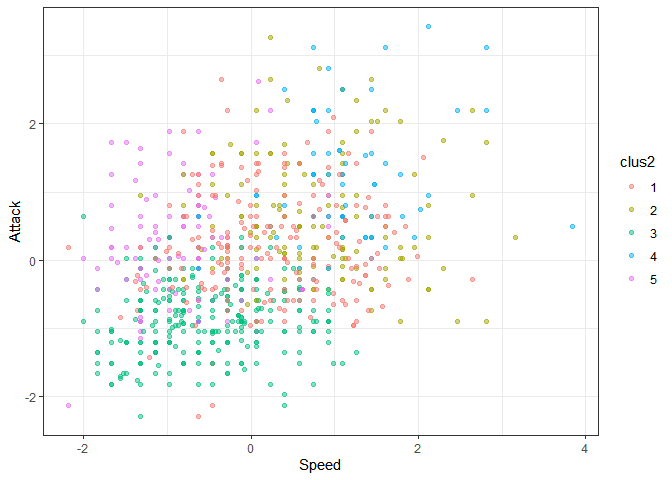
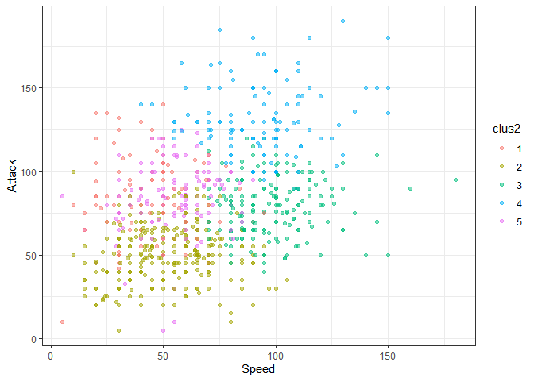

Ayudantia 5 Clusters
================

# Actividad Ayudantia 5

Realizar análisis de clustering (K-means, incluye preprocesamiento de la
data) e índices de evaluación para el archivo “sandwiches.csv” tomando
las columnas de nota y precio. Hacer análisis para diferentes K y/o
medidas de distancia para que vean cómo se comporta el clustering (En
caso de tener algún problema con ese csv, pueden utilizar el csv de
Pokémon también para la actividad)

# Algoritmo de clustering base:

## K-Medias

Para el análisis de clusters vamos a analizar la data de “pokemon.csv”
que contiene la información de los pokemones de 7 de sus generaciones,
echaremos un vistazo a las variables presentes.

``` r
library(tidyverse)
```

    ## -- Attaching packages --------------------------------------- tidyverse 1.3.1 --

    ## v ggplot2 3.3.4     v purrr   0.3.4
    ## v tibble  3.1.2     v dplyr   1.0.6
    ## v tidyr   1.1.3     v stringr 1.4.0
    ## v readr   1.4.0     v forcats 0.5.1

    ## -- Conflicts ------------------------------------------ tidyverse_conflicts() --
    ## x dplyr::filter() masks stats::filter()
    ## x dplyr::lag()    masks stats::lag()

``` r
library(readr)
data_pok <- read_csv("C:/Users/josev/Desktop/Ayudantias/Ayudantia 5/pokemon.csv")
```

    ## 
    ## -- Column specification --------------------------------------------------------
    ## cols(
    ##   `#` = col_double(),
    ##   Name = col_character(),
    ##   `Type 1` = col_character(),
    ##   `Type 2` = col_character(),
    ##   Total = col_double(),
    ##   HP = col_double(),
    ##   Attack = col_double(),
    ##   Defense = col_double(),
    ##   `Sp. Atk` = col_double(),
    ##   `Sp. Def` = col_double(),
    ##   Speed = col_double(),
    ##   Generation = col_double(),
    ##   Legendary = col_logical()
    ## )

``` r
head(data_pok)
```

    ## # A tibble: 6 x 13
    ##     `#` Name    `Type 1` `Type 2` Total    HP Attack Defense `Sp. Atk` `Sp. Def`
    ##   <dbl> <chr>   <chr>    <chr>    <dbl> <dbl>  <dbl>   <dbl>     <dbl>     <dbl>
    ## 1     1 Bulbas~ Grass    Poison     318    45     49      49        65        65
    ## 2     2 Ivysaur Grass    Poison     405    60     62      63        80        80
    ## 3     3 Venusa~ Grass    Poison     525    80     82      83       100       100
    ## 4     3 Venusa~ Grass    Poison     625    80    100     123       122       120
    ## 5     4 Charma~ Fire     <NA>       309    39     52      43        60        50
    ## 6     5 Charme~ Fire     <NA>       405    58     64      58        80        65
    ## # ... with 3 more variables: Speed <dbl>, Generation <dbl>, Legendary <lgl>

``` r
summary(data_pok)
```

    ##        #             Name              Type 1             Type 2         
    ##  Min.   :  1.0   Length:800         Length:800         Length:800        
    ##  1st Qu.:184.8   Class :character   Class :character   Class :character  
    ##  Median :364.5   Mode  :character   Mode  :character   Mode  :character  
    ##  Mean   :362.8                                                           
    ##  3rd Qu.:539.2                                                           
    ##  Max.   :721.0                                                           
    ##      Total             HP             Attack       Defense      
    ##  Min.   :180.0   Min.   :  1.00   Min.   :  5   Min.   :  5.00  
    ##  1st Qu.:330.0   1st Qu.: 50.00   1st Qu.: 55   1st Qu.: 50.00  
    ##  Median :450.0   Median : 65.00   Median : 75   Median : 70.00  
    ##  Mean   :435.1   Mean   : 69.26   Mean   : 79   Mean   : 73.84  
    ##  3rd Qu.:515.0   3rd Qu.: 80.00   3rd Qu.:100   3rd Qu.: 90.00  
    ##  Max.   :780.0   Max.   :255.00   Max.   :190   Max.   :230.00  
    ##     Sp. Atk          Sp. Def          Speed          Generation   
    ##  Min.   : 10.00   Min.   : 20.0   Min.   :  5.00   Min.   :1.000  
    ##  1st Qu.: 49.75   1st Qu.: 50.0   1st Qu.: 45.00   1st Qu.:2.000  
    ##  Median : 65.00   Median : 70.0   Median : 65.00   Median :3.000  
    ##  Mean   : 72.82   Mean   : 71.9   Mean   : 68.28   Mean   :3.324  
    ##  3rd Qu.: 95.00   3rd Qu.: 90.0   3rd Qu.: 90.00   3rd Qu.:5.000  
    ##  Max.   :194.00   Max.   :230.0   Max.   :180.00   Max.   :6.000  
    ##  Legendary      
    ##  Mode :logical  
    ##  FALSE:735      
    ##  TRUE :65       
    ##                 
    ##                 
    ## 

Para clusterizar vamos a seleccionar las variables de Hp, Ataque,
Defensa, Speed, Generacion y Legendary. Para analizar el comportamiento
vamos a excluir Special Attack y Special Defense.

Antes de clusterizar debemos preparar la data\_pok:

-   Eliminando datos faltantes.

-   Pasar Legendary a numérico.

-   Escalar la data\_pok

``` r
#Como no tenemos datos nulos obviamos este paso

levels(data_pok$Legendary) <- c(0,1)
data_pok$Legendary <- as.numeric(data_pok$Legendary)


numdata_pok <- data_pok[, colnames(data_pok) %in% c("HP", "Attack", "Defense", "Speed", "Generation", "Legendary")]

escal_data_pok = scale(numdata_pok) %>% as_tibble()

escal_data_pok %>% summary()
```

    ##        HP              Attack           Defense            Speed        
    ##  Min.   :-2.6732   Min.   :-2.2800   Min.   :-2.2077   Min.   :-2.1774  
    ##  1st Qu.:-0.7542   1st Qu.:-0.7395   1st Qu.:-0.7646   1st Qu.:-0.8010  
    ##  Median :-0.1668   Median :-0.1233   Median :-0.1232   Median :-0.1128  
    ##  Mean   : 0.0000   Mean   : 0.0000   Mean   : 0.0000   Mean   : 0.0000  
    ##  3rd Qu.: 0.4207   3rd Qu.: 0.6470   3rd Qu.: 0.5181   3rd Qu.: 0.7475  
    ##  Max.   : 7.2741   Max.   : 3.4198   Max.   : 5.0077   Max.   : 3.8445  
    ##    Generation        Legendary      
    ##  Min.   :-1.3988   Min.   :-0.2972  
    ##  1st Qu.:-0.7968   1st Qu.:-0.2972  
    ##  Median :-0.1949   Median :-0.2972  
    ##  Mean   : 0.0000   Mean   : 0.0000  
    ##  3rd Qu.: 1.0090   3rd Qu.:-0.2972  
    ##  Max.   : 1.6109   Max.   : 3.3606

Ya tenemos escalada la data\_pok, vamos a aplicar el algoritmo de
kmedias, que viene implementado en R base. Para probar, vamos a aplicar
kmedias con k = 10

## Analisis Cluster K = 10

``` r
modelo_kmeans <- kmeans(escal_data_pok, centers = 10)
modelo_kmeans2 <- kmeans(numdata_pok, centers = 10)

# creo la variable cluster en la tabla escal_data_pokda
escal_data_pok$clus <- modelo_kmeans$cluster %>% as.factor()
numdata_pok$clus <- modelo_kmeans2$cluster %>% as.factor()

ggplot(escal_data_pok, aes(Speed, Attack, color=clus)) +
  geom_point(alpha=0.5, show.legend = T) +
  theme_bw()
```

<!-- -->

``` r
ggplot(numdata_pok, aes(Speed, Attack, color=clus)) +
  geom_point(alpha=0.5, show.legend = T) +
  theme_bw()
```

<!-- -->

``` r
info_clus <- modelo_kmeans$centers
info_clus2 <- modelo_kmeans2$centers

info_clus
```

    ##             HP       Attack     Defense      Speed Generation  Legendary
    ## 1   3.52492983 -0.377970188 -0.86079175 -0.6404174 -0.6363026 -0.2971949
    ## 2  -0.27782009 -0.137775760 -0.40014090  1.0681225 -1.0092704 -0.2971949
    ## 3   0.81779384  0.569289058  0.44090782 -0.4350823  1.0174829 -0.2971949
    ## 4  -0.84842864 -0.900197303 -0.78118178 -0.6782775 -0.7715641 -0.2971949
    ## 5   0.91952285  1.160774205  0.82797114  1.0979558  0.2681535  3.3605889
    ## 6  -0.40387459  0.002459567  2.28709609 -1.0511794  0.1304953 -0.2971949
    ## 7  -0.64285149 -0.731526939 -0.61301448 -0.6550242  1.0184101 -0.2971949
    ## 8   0.35082621  0.244404068  0.37776841 -0.3974844 -0.8252138 -0.2971949
    ## 9   0.53482206  1.676215189  0.53607907  0.9224642 -0.2254858 -0.2971949
    ## 10  0.02988987 -0.011211241 -0.04745659  0.9426147  0.8965542 -0.2971949

``` r
info_clus2
```

    ##           HP    Attack   Defense     Speed Generation  Legendary
    ## 1   93.50820 143.04918  92.90164 103.72131   3.475410 0.50819672
    ## 2   59.57851  73.33058  57.47934  55.80992   3.438017 0.00000000
    ## 3   51.58163  41.56122  48.77551  36.08163   3.357143 0.00000000
    ## 4   77.09302 109.30233 140.90698  46.32558   3.441860 0.11627907
    ## 5   54.56250  67.37500 105.82500  45.07500   3.262500 0.01250000
    ## 6  123.40476  68.16667  65.38095  46.80952   3.166667 0.00000000
    ## 7   85.61972  87.73239 100.09859  85.64789   3.211268 0.22535211
    ## 8   45.58333  45.96875  42.91667  73.85417   3.125000 0.00000000
    ## 9   70.53153  82.82883  67.40541 108.36937   3.252252 0.09909910
    ## 10  81.71429 113.50649  73.92208  68.07792   3.519481 0.01298701

## Evolución suma de cuadrados intra-cluster en la medida que aumentamos el numero de k

``` r
SSinterior <- numeric(30)

for(k in 1:30){
  modelo <- kmeans(escal_data_pok, centers = k)
  SSinterior[k] <- modelo$tot.withinss
}

plot(SSinterior)
```

<!-- -->

## Metodo del Codo 2

``` r
#Calculando K para Data normalizada
k.max <- 30
wss1 <- sapply(1:k.max, 
              function(k){kmeans(escal_data_pok, k, nstart=50,iter.max = 8)$tot.withinss})
wss2 <- sapply(1:k.max, 
              function(k){kmeans(numdata_pok, k, nstart=50,iter.max = 8)$tot.withinss})
```

    ## Warning: did not converge in 8 iterations

    ## Warning: did not converge in 8 iterations

    ## Warning: did not converge in 8 iterations

    ## Warning: did not converge in 8 iterations

    ## Warning: did not converge in 8 iterations

    ## Warning: did not converge in 8 iterations

    ## Warning: did not converge in 8 iterations

    ## Warning: did not converge in 8 iterations

    ## Warning: did not converge in 8 iterations

    ## Warning: did not converge in 8 iterations

    ## Warning: did not converge in 8 iterations

    ## Warning: did not converge in 8 iterations

    ## Warning: did not converge in 8 iterations

    ## Warning: did not converge in 8 iterations

    ## Warning: did not converge in 8 iterations

    ## Warning: did not converge in 8 iterations

    ## Warning: did not converge in 8 iterations

    ## Warning: did not converge in 8 iterations

    ## Warning: did not converge in 8 iterations

    ## Warning: did not converge in 8 iterations

    ## Warning: did not converge in 8 iterations

    ## Warning: did not converge in 8 iterations

    ## Warning: did not converge in 8 iterations

    ## Warning: did not converge in 8 iterations

    ## Warning: did not converge in 8 iterations

    ## Warning: did not converge in 8 iterations

    ## Warning: did not converge in 8 iterations

    ## Warning: did not converge in 8 iterations

    ## Warning: did not converge in 8 iterations

    ## Warning: did not converge in 8 iterations

    ## Warning: did not converge in 8 iterations

    ## Warning: did not converge in 8 iterations

    ## Warning: did not converge in 8 iterations

    ## Warning: did not converge in 8 iterations

    ## Warning: did not converge in 8 iterations

    ## Warning: did not converge in 8 iterations

    ## Warning: did not converge in 8 iterations

    ## Warning: did not converge in 8 iterations

    ## Warning: did not converge in 8 iterations

    ## Warning: did not converge in 8 iterations

    ## Warning: did not converge in 8 iterations

    ## Warning: did not converge in 8 iterations

    ## Warning: did not converge in 8 iterations

    ## Warning: did not converge in 8 iterations

    ## Warning: did not converge in 8 iterations

    ## Warning: did not converge in 8 iterations

    ## Warning: did not converge in 8 iterations

    ## Warning: did not converge in 8 iterations

``` r
#wss1
plot(1:k.max, wss1,
     type="b", pch = 19, frame = FALSE, 
     xlab="Numeros de clusters K",
     ylab="Total within-clusters sum of squares")
```

<!-- -->

``` r
plot(1:k.max, wss2,
     type="b", pch = 19, frame = FALSE, 
     xlab="Numeros de clusters K",
     ylab="Total within-clusters sum of squares")
```

<!-- -->

# Evaluacion

Existen diversos metodos de evaluacion de calidad de los clusters
resultantes.

## Inspeccion visual

``` r
escal_data_pok$clus <- as.numeric(escal_data_pok$clus)
numdata_pok$clus <- as.numeric(numdata_pok$clus)

# uso distancia euclidiana
tempDist <- dist(escal_data_pok) %>% as.matrix()

#reordeno filas y columnas en base al cluster obtenido
index <- sort(modelo_kmeans$cluster, index.return=TRUE)
tempDist <- tempDist[index$ix,index$ix]
rownames(tempDist) <- c(1:nrow(escal_data_pok))
colnames(tempDist) <- c(1:nrow(escal_data_pok))

image(tempDist)
```

<!-- -->

## Estadistico de Hopkins.

``` r
library(factoextra)
```

    ## Welcome! Want to learn more? See two factoextra-related books at https://goo.gl/ve3WBa

``` r
#Calcula el hopkins statistic 
res <- get_clust_tendency(escal_data_pok, n = 30, graph = FALSE)
res2 <- get_clust_tendency(numdata_pok, n = 30, graph = FALSE)

print(res)
```

    ## $hopkins_stat
    ## [1] 0.8733114
    ## 
    ## $plot
    ## NULL

``` r
print(res2)
```

    ## $hopkins_stat
    ## [1] 0.8698676
    ## 
    ## $plot
    ## NULL

## Indice de correlación

``` r
#Correlation
#construyo matriz de correlacion ideal (cada entidad correlaciona 1 con su cluster)
tempMatrix <- matrix(0, nrow = nrow(numdata_pok), ncol = nrow(numdata_pok))
tempMatrix[which(index$x==1), which(index$x==1)]  <- 1
tempMatrix[which(index$x==2), which(index$x==2)]  <- 1
tempMatrix[which(index$x==3), which(index$x==3)]  <- 1
tempMatrix[which(index$x==4), which(index$x==4)]  <- 1
tempMatrix[which(index$x==5), which(index$x==5)]  <- 1
tempMatrix[which(index$x==6), which(index$x==6)]  <- 1
tempMatrix[which(index$x==7), which(index$x==7)]  <- 1
tempMatrix[which(index$x==8), which(index$x==8)]  <- 1
tempMatrix[which(index$x==9), which(index$x==9)]  <- 1
tempMatrix[which(index$x==10), which(index$x==10)] <- 1

#construyo matriz de disimilitud
tempDist2 <- 1/(1+tempDist)

#Calcula correlacion 
cor <- cor(tempMatrix[upper.tri(tempMatrix)],tempDist2[upper.tri(tempDist2)])

print(cor)
```

    ## [1] 0.7662487

## Indice de cohesión y el de separación.

``` r
library(flexclust) # usaremos la distancia implementada en flexclus (dist2) que maneja mejor objetos de diferente tamaño
```

    ## Loading required package: grid

    ## Loading required package: lattice

    ## Loading required package: modeltools

    ## Loading required package: stats4

``` r
#escal_data_pok <- apply(escal_data_pok,2,as.numeric)
 
#Cohesion
withinCluster <- numeric(10)
for (i in 1:10){
  tempdata_pok <- escal_data_pok[which(modelo_kmeans$cluster == i),]
  withinCluster[i] <- sum(dist2(tempdata_pok,colMeans(tempdata_pok))^2)
}
cohesion = sum(withinCluster)
#es equivalente a model$tot.withinss en k-means
print(c(cohesion, modelo_kmeans$tot.withinss))
```

    ## [1] 1550.621 1550.621

``` r
#Separation
meandata_pok <- colMeans(escal_data_pok)
SSB <- numeric(10)
for (i in 1:10){
  tempdata_pok <- escal_data_pok[which(modelo_kmeans$cluster==i),]
  SSB[i] <- nrow(tempdata_pok)*sum((meandata_pok-colMeans(tempdata_pok))^2)
}
separation = sum(SSB)

print(separation)
```

    ## [1] 8781.374

## Coeficiente de silueta

``` r
library(cluster)

coefSil <- silhouette(modelo_kmeans$cluster,dist(escal_data_pok))
summary(coefSil)
```

    ## Silhouette of 800 units in 10 clusters from silhouette.default(x = modelo_kmeans$cluster, dist = dist(escal_data_pok)) :
    ##  Cluster sizes and average silhouette widths:
    ##        15        85        71       143        65        37       128       106 
    ## 0.3164571 0.4941919 0.4593893 0.4675270 0.4887298 0.2930451 0.5159364 0.3467789 
    ##        59        91 
    ## 0.1938451 0.4602796 
    ## Individual silhouette widths:
    ##    Min. 1st Qu.  Median    Mean 3rd Qu.    Max. 
    ## 0.01185 0.34954 0.45570 0.43120 0.53224 0.64359

``` r
#visualizamos el codigo de silueta de cada cluster
fviz_silhouette(coefSil) + coord_flip()
```

    ##    cluster size ave.sil.width
    ## 1        1   15          0.32
    ## 2        2   85          0.49
    ## 3        3   71          0.46
    ## 4        4  143          0.47
    ## 5        5   65          0.49
    ## 6        6   37          0.29
    ## 7        7  128          0.52
    ## 8        8  106          0.35
    ## 9        9   59          0.19
    ## 10      10   91          0.46

<!-- -->

## Utilizamos el coeficiente de silueta para encontrar el mejor valor de K

``` r
coefSil=numeric(30)
for (k in 2:30){
  modelo <- kmeans(escal_data_pok, centers = k)
  temp <- silhouette(modelo$cluster,dist(escal_data_pok))
  coefSil[k] <- mean(temp[,3])
}
tempDF=data.frame(CS=coefSil,K=c(1:30))

ggplot(tempDF, aes(x=K, y=CS)) + 
  geom_line() +
  scale_x_continuous(breaks=c(1:30))
```

<!-- -->

# 2do Análisis Cluster

``` r
numdata_pok2 <- data_pok[, colnames(data_pok) %in% c("Type.1","HP", "Attack", "Defense", "Speed", "Generation", "Legendary")]
escal_data_pok2 = scale(numdata_pok2) %>% as_tibble()

modelo_kmean <- kmeans(escal_data_pok2, centers = 5)
modelo_kmean2 <- kmeans(numdata_pok2, centers = 5)

# creo la variable cluster en la tabla escal_data_pokda
escal_data_pok2$clus2 <- modelo_kmean$cluster %>% as.factor()
numdata_pok2$clus2 <- modelo_kmean2$cluster %>% as.factor()

ggplot(escal_data_pok2, aes(Speed, Attack, color=clus2)) +
  geom_point(alpha=0.5, show.legend = T) +
  theme_bw()
```

<!-- -->

``` r
ggplot(numdata_pok2, aes(Speed, Attack, color=clus2)) +
  geom_point(alpha=0.5, show.legend = T) +
  theme_bw()
```

<!-- -->

``` r
info_clusters <- modelo_kmean$centers
info_clusters2 <- modelo_kmean2$centers

info_clusters
```

    ##           HP     Attack     Defense      Speed  Generation  Legendary
    ## 1  0.5454591  0.2092492 -0.06621201  0.2659128  0.93908228 -0.2971949
    ## 2  0.3133934  0.5981004  0.10677039  0.7001505 -0.91184106 -0.2971949
    ## 3 -0.7346385 -0.8481904 -0.75478199 -0.5426720 -0.19271337 -0.2971949
    ## 4  0.9195228  1.1607742  0.82797114  1.0979558  0.26815346  3.3605889
    ## 5 -0.1249330  0.2452304  1.49370878 -0.8144966 -0.06504806 -0.2971949

``` r
info_clusters2
```

    ##         HP    Attack   Defense    Speed Generation  Legendary
    ## 1 64.65625  86.19792 124.96875 44.78125   3.343750 0.06250000
    ## 2 49.60294  51.18015  50.45588 51.37500   3.279412 0.00000000
    ## 3 68.97207  78.96648  69.94972 98.65363   3.234637 0.05586592
    ## 4 88.61600 130.20000  92.66400 93.57600   3.488000 0.36000000
    ## 5 95.97656  82.77344  72.25781 54.63281   3.367188 0.03125000

# Evaluacion

## Inspeccion visual

``` r
escal_data_pok2$clus <- as.numeric(escal_data_pok2$clus2)
numdata_pok2$clus <- as.numeric(numdata_pok2$clus2)

# uso distancia euclidiana
tempDist_2 <- dist(escal_data_pok2) %>% as.matrix()

#reordeno filas y columnas en base al cluster obtenido
index <- sort(modelo_kmean$cluster, index.return=TRUE)
tempDist_2 <- tempDist_2[index$ix,index$ix]
rownames(tempDist_2) <- c(1:nrow(data_pok))
colnames(tempDist_2) <- c(1:nrow(data_pok))

image(tempDist_2)
```

<!-- -->

## Estadistico de Hopkins.

``` r
library(factoextra)

escal_data_pok2$clus2 <- NULL
numdata_pok2$clus2 <- NULL

#Calcula el hopkins statistic 
res_1 <- get_clust_tendency(escal_data_pok2, n = 30, graph = FALSE)
res_2 <- get_clust_tendency(numdata_pok2, n = 30, graph = FALSE)

print(res_1)
```

    ## $hopkins_stat
    ## [1] 0.8636013
    ## 
    ## $plot
    ## NULL

``` r
print(res_2)
```

    ## $hopkins_stat
    ## [1] 0.8720671
    ## 
    ## $plot
    ## NULL

## Indice de correlación

``` r
#Correlation
#construyo matriz de correlacion ideal (cada entidad correlaciona 1 con su cluster)
tempMatrix2 <- matrix(0, nrow = nrow(escal_data_pok2), ncol = nrow(escal_data_pok2))
tempMatrix2[which(index$x==1), which(index$x==1)]  <- 1
tempMatrix2[which(index$x==2), which(index$x==2)]  <- 1
tempMatrix2[which(index$x==3), which(index$x==3)]  <- 1
tempMatrix2[which(index$x==4), which(index$x==4)]  <- 1
tempMatrix2[which(index$x==5), which(index$x==5)]  <- 1

#construyo matriz de disimilitud
tempDist_22 <- 1/(1+tempDist_2)

#Calcula correlacion 
cor2 <- cor(tempMatrix2[upper.tri(tempMatrix2)],tempDist_2[upper.tri(tempDist_2)])

print(cor2)
```

    ## [1] -0.6442484

## Indice de cohesión y el de separación.

``` r
library(flexclust) # usaremos la distancia implementada en flexclus (dist2) que maneja mejor objetos de diferente tamaño
escal_data_pok2 <- apply(escal_data_pok2,2,as.numeric)
 
#Cohesion
withinCluster <- numeric(4)
for (i in 1:4){
  tempdata_pok2 <- escal_data_pok2[which(modelo_kmean$cluster == i),]
  withinCluster[i] <- sum(dist2(tempdata_pok2,colMeans(tempdata_pok2))^2)
}
cohesion2 = sum(withinCluster)
#es equivalente a model$tot.withinss en k-means
print(c(cohesion2, modelo_kmean$tot.withinss))
```

    ## [1] 1931.794 2282.927

``` r
#Separation
meandata_pok2 <- colMeans(escal_data_pok2)
SSB <- numeric(4)
for (i in 1:4){
  tempdata_pok2 <- escal_data_pok2[which(modelo_kmean$cluster==i),]
  SSB[i] <- nrow(tempdata_pok2)*sum((meandata_pok2-colMeans(tempdata_pok2))^2)
}
separation2 = sum(SSB)

print(separation2)
```

    ## [1] 2954.145

## Coeficiente de silueta

``` r
library(cluster)

coefSil2 <- silhouette(modelo_kmean$cluster,dist(escal_data_pok2))
summary(coefSil2)
```

    ## Silhouette of 800 units in 5 clusters from silhouette.default(x = modelo_kmean$cluster, dist = dist(escal_data_pok2)) :
    ##  Cluster sizes and average silhouette widths:
    ##       198       157       278        65       102 
    ## 0.2717306 0.2816077 0.3700881 0.4873001 0.3612039 
    ## Individual silhouette widths:
    ##    Min. 1st Qu.  Median    Mean 3rd Qu.    Max. 
    ## 0.01745 0.24981 0.34120 0.33677 0.42101 0.62346

``` r
#visualizamos el codigo de silueta de cada cluster
fviz_silhouette(coefSil2) + coord_flip()
```

    ##   cluster size ave.sil.width
    ## 1       1  198          0.27
    ## 2       2  157          0.28
    ## 3       3  278          0.37
    ## 4       4   65          0.49
    ## 5       5  102          0.36

<!-- -->
