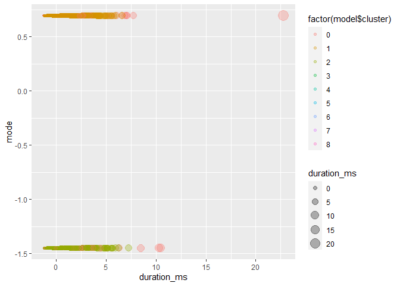
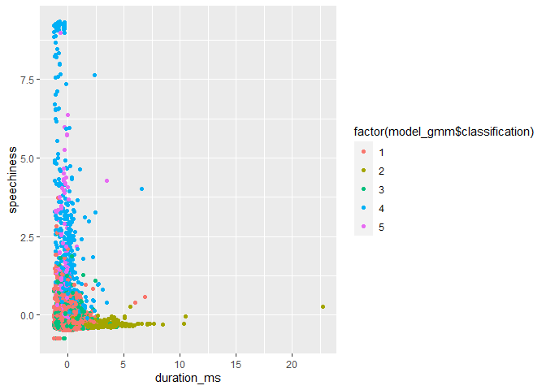
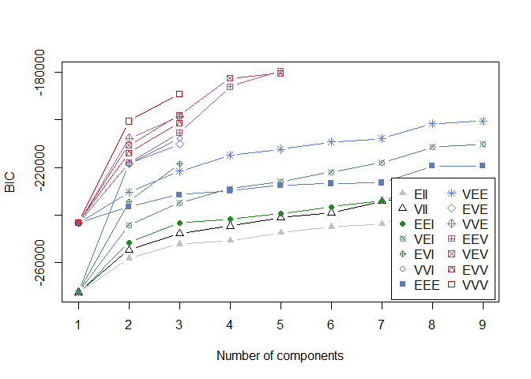
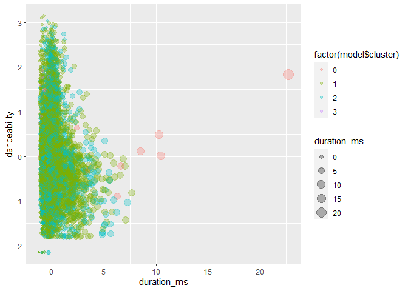
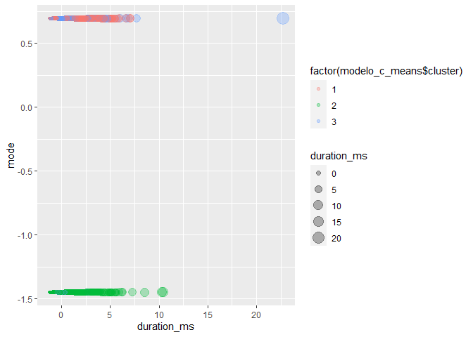
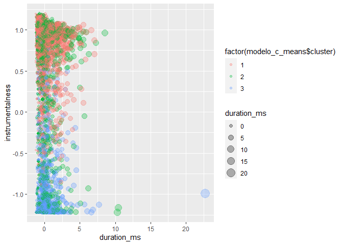

Ayudantía 8
================

\#\#Instalar librerias

``` r
library(tidyverse)
```

    ## Warning: package 'tidyverse' was built under R version 3.6.3

    ## -- Attaching packages --------------------------------------- tidyverse 1.3.1 --

    ## v ggplot2 3.3.3     v purrr   0.3.4
    ## v tibble  3.1.1     v dplyr   1.0.6
    ## v tidyr   1.1.3     v stringr 1.4.0
    ## v readr   1.4.0     v forcats 0.5.1

    ## Warning: package 'ggplot2' was built under R version 3.6.3

    ## Warning: package 'tibble' was built under R version 3.6.3

    ## Warning: package 'tidyr' was built under R version 3.6.3

    ## Warning: package 'readr' was built under R version 3.6.3

    ## Warning: package 'purrr' was built under R version 3.6.3

    ## Warning: package 'dplyr' was built under R version 3.6.3

    ## Warning: package 'forcats' was built under R version 3.6.3

    ## -- Conflicts ------------------------------------------ tidyverse_conflicts() --
    ## x dplyr::filter() masks stats::filter()
    ## x dplyr::lag()    masks stats::lag()

``` r
library(cluster)
```

    ## Warning: package 'cluster' was built under R version 3.6.3

``` r
library(factoextra)
```

    ## Warning: package 'factoextra' was built under R version 3.6.3

    ## Welcome! Want to learn more? See two factoextra-related books at https://goo.gl/ve3WBa

``` r
library(mclust)
```

    ## Warning: package 'mclust' was built under R version 3.6.3

    ## Package 'mclust' version 5.4.7
    ## Type 'citation("mclust")' for citing this R package in publications.

    ## 
    ## Attaching package: 'mclust'

    ## The following object is masked from 'package:purrr':
    ## 
    ##     map

\#\#Se lee la base de datos

``` r
library(readr)
Spotify <- read_csv("Spotify.csv")
```

    ## 
    ## -- Column specification --------------------------------------------------------
    ## cols(
    ##   artist_name = col_character(),
    ##   track_name = col_character(),
    ##   album_name = col_character(),
    ##   danceability = col_double(),
    ##   energy = col_double(),
    ##   key = col_double(),
    ##   loudness = col_double(),
    ##   mode = col_double(),
    ##   speechiness = col_double(),
    ##   acousticness = col_double(),
    ##   instrumentalness = col_double(),
    ##   liveness = col_double(),
    ##   valence = col_double(),
    ##   tempo = col_double(),
    ##   duration_ms = col_double()
    ## )

## Omitir datos N/A

    ## [1] 13000    15

## Veificamos tipos de datos

``` r
str(Spotify)
```

    ## tibble [13,000 x 15] (S3: tbl_df/tbl/data.frame)
    ##  $ artist_name     : chr [1:13000] "Mother Nature Sound FX" "Johann Sebastian Bach" "Mother Nature Sound FX" "Frédéric Chopin" ...
    ##  $ track_name      : chr [1:13000] "Mountain Creeks" "Musikalisches Opfer, Op. 6, BWV 1079: Musical Offering, BWV 1079: Ricercar à 3" "Forest of Rainfall" "Waltz No.6 In D Flat, Op.64 No.1 -\"Minute\"" ...
    ##  $ album_name      : chr [1:13000] "! ! ! ! ! Earthbound ! ! ! ! !" "Bach: Variations & More" "! ! ! \" Scenes \" ! ! !" "Chopin Cosy Moments" ...
    ##  $ danceability    : num [1:13000] 0.222 0.287 0.235 0.322 0.447 0.117 0.596 0.445 0.363 0.159 ...
    ##  $ energy          : num [1:13000] 0.78 0.545 1 0.105 0.054 0.411 0.049 0.785 0.112 0.24 ...
    ##  $ key             : num [1:13000] 0 11 0 1 2 10 10 0 6 0 ...
    ##  $ loudness        : num [1:13000] -29.7 -16.2 -15.4 -25.7 -31.1 ...
    ##  $ mode            : num [1:13000] 1 0 0 1 1 0 1 1 1 0 ...
    ##  $ speechiness     : num [1:13000] 0.1 0.0309 0.0977 0.0401 0.0382 0.0654 0.0438 0.0353 0.0407 0.037 ...
    ##  $ acousticness    : num [1:13000] 0.67 0.706 0.79 0.99 0.974 0.000738 0.973 0.172 0.989 0.979 ...
    ##  $ instrumentalness: num [1:13000] 0.897 0.909 0.862 0.876 0.899 0.938 0.634 0 0.882 0.533 ...
    ##  $ liveness        : num [1:13000] 0.662 0.0482 0.96 0.142 0.137 0.886 0.074 0.372 0.102 0.501 ...
    ##  $ valence         : num [1:13000] 0.0127 0.84 0.00001 0.246 0.281 0.0463 0.343 0.554 0.0859 0.148 ...
    ##  $ tempo           : num [1:13000] 86.2 137 83.5 65.1 127.4 ...
    ##  $ duration_ms     : num [1:13000] 153469 362653 197488 118315 154706 ...

## Creamos un sampleo de datos

### De esta manera se demora menos en correr el codigo

``` r
set.seed(369)
sampleIndex <- sample(1:nrow(Spotify),8000, replace = F)
Spotify <- Spotify[sampleIndex,]
dim(Spotify)
```

    ## [1] 8000   15

## Separar datos

``` r
Spotify_char<- c("artist_name", "track_name", "album_name")
Spotify_num <- c("danceability", "energy", "key", "loudness", "mode", "speechiness", "acousticness", "instrumentalness", "liveness", "valence", "tempo", "duration_ms")


Spotifynum <- Spotify %>% 
  select(Spotify_num)
```

    ## Note: Using an external vector in selections is ambiguous.
    ## i Use `all_of(Spotify_num)` instead of `Spotify_num` to silence this message.
    ## i See <https://tidyselect.r-lib.org/reference/faq-external-vector.html>.
    ## This message is displayed once per session.

``` r
Spotifychar <- Spotify %>% 
  select(Spotify_char)
```

    ## Note: Using an external vector in selections is ambiguous.
    ## i Use `all_of(Spotify_char)` instead of `Spotify_char` to silence this message.
    ## i See <https://tidyselect.r-lib.org/reference/faq-external-vector.html>.
    ## This message is displayed once per session.

## Escalar datos numericos

``` r
spotifysca = scale(Spotifynum) %>% as_tibble()
```

## DBScan

### Despues de probar distintos parametros se escogieron los siguientes ya que la cantidad de puntos de ruido era relativamente aceptable y la cantidad de canciones en cada cluster no era tan grande, excepto en los cluster 1 y 2 que tienen la mayor cantidad de clusters

``` r
library(dbscan)
```

    ## Warning: package 'dbscan' was built under R version 3.6.3

``` r
set.seed(369)

model = dbscan(spotifysca, eps = 2, minPts = 8)

model
```

    ## DBSCAN clustering for 8000 objects.
    ## Parameters: eps = 2, minPts = 8
    ## The clustering contains 8 cluster(s) and 320 noise points.
    ## 
    ##    0    1    2    3    4    5    6    7    8 
    ##  320 5229 2368   18   13   20   10   13    9 
    ## 
    ## Available fields: cluster, eps, minPts

## Grafico Mode vs duration\_ms

### Podemos identificar cierta tendencia donde mientras mas alta la duración de la cancion o pertenece a un punto de ruido o pertenece al cluster 8. Tambien dadas las leves diferencias de color podemos identificar que en cuanto al mode igual se generaron clusters y se dividieron en cto eso.

``` r
ggplot(spotifysca, aes(duration_ms, mode, color = factor(model$cluster), size = duration_ms)) + 
  geom_point(alpha = 0.3) 
```

<!-- --> \#\#
Fuzzy C-Means

``` r
library(e1071)
```

    ## Warning: package 'e1071' was built under R version 3.6.3

``` r
set.seed(369)

modelo_c_means <- cmeans(spotifysca,  7, m=2) 

modelo_c_means$membership %>% head()
```

    ##              1         2         3          4         5         6          7
    ## [1,] 0.1250583 0.1250654 0.1250594 0.18653636 0.1250678 0.1250596 0.18815316
    ## [2,] 0.1390693 0.1390709 0.1390695 0.15226635 0.1390715 0.1390696 0.15238279
    ## [3,] 0.1734212 0.1734166 0.1734205 0.06613470 0.1734152 0.1734203 0.06677149
    ## [4,] 0.1679139 0.1679123 0.1679137 0.07983223 0.1679118 0.1679136 0.08060258
    ## [5,] 0.1720424 0.1720361 0.1720415 0.06959134 0.1720341 0.1720412 0.07021333
    ## [6,] 0.1031306 0.1031342 0.1031312 0.24340696 0.1031353 0.1031313 0.24093051

## Plot duracion vs speechiness

### En este gráfico se puede notar mejor la tendencia de cada cluster pero aun asi no se ven grupos totalmente definidos

``` r
ggplot(spotifysca, aes(duration_ms, speechiness, color = factor(modelo_c_means$cluster), size = duration_ms)) + 
  geom_point(alpha = 0.3) 
```

<!-- --> \#\# FPC
\#\#\# Indice bajo, por lo que existe alta variabilidad en los clusters.
No es lo ideal. Deberian tener una tendencia definida

``` r
matriz <- modelo_c_means$membership%*%t(modelo_c_means$membership) # producto matricial
(FPC <- sum(matriz*diag(nrow(matriz)))/nrow(matriz))
```

    ## [1] 0.1575119

\#\#GMM

``` r
library(mclust)

set.seed(369)

model_gmm = Mclust(spotifysca)

model_gmm 
```

    ## 'Mclust' model object: (EEV,5) 
    ## 
    ## Available components: 
    ##  [1] "call"           "data"           "modelName"      "n"             
    ##  [5] "d"              "G"              "BIC"            "loglik"        
    ##  [9] "df"             "bic"            "icl"            "hypvol"        
    ## [13] "parameters"     "z"              "classification" "uncertainty"

``` r
summary(model_gmm, parameters = TRUE)
```

    ## ---------------------------------------------------- 
    ## Gaussian finite mixture model fitted by EM algorithm 
    ## ---------------------------------------------------- 
    ## 
    ## Mclust EEV (ellipsoidal, equal volume and shape) model with 5 components: 
    ## 
    ##  log-likelihood    n  df       BIC       ICL
    ##       -87903.41 8000 406 -179455.6 -179795.7
    ## 
    ## Clustering table:
    ##    1    2    3    4    5 
    ## 4335  532 2008  479  646 
    ## 
    ## Mixing probabilities:
    ##          1          2          3          4          5 
    ## 0.53826824 0.07142911 0.24854370 0.06083426 0.08092469 
    ## 
    ## Means:
    ##                         [,1]        [,2]        [,3]        [,4]         [,5]
    ## danceability      0.06324223 -0.51793524  0.07677483  0.84590334 -0.835189294
    ## energy           -0.22666504 -0.43106397 -0.10954558  1.07805704  1.414168684
    ## key              -0.08793864 -0.01305357  0.14407076  0.19179493  0.009779433
    ## loudness         -0.05739008 -0.05317266  0.01128486  1.11902277 -0.447210511
    ## mode              0.69147439  0.10070294 -1.44600439 -0.13013408 -0.149273796
    ## speechiness      -0.21372728 -0.29108886 -0.20594827  2.08926601  0.740478706
    ## acousticness      0.15601744  0.36467844  0.03053910 -1.04410761 -0.668531073
    ## instrumentalness  0.03111561  0.27318603  0.06044587 -1.16516616  0.242158543
    ## liveness         -0.31410121  0.39478306 -0.31174563  1.40085366  1.645161879
    ## valence           0.15168356 -0.61564995  0.04554921  0.65533875 -1.098047197
    ## tempo             0.07158919 -0.19114278 -0.03045901  0.30587460 -0.443848297
    ## duration_ms      -0.15551099  2.15021622 -0.12837831  0.04210305 -0.500898855
    ## 
    ## Variances:
    ## [,,1]
    ##                   danceability        energy           key      loudness
    ## danceability      1.045887e+00  4.307295e-01  3.231165e-02  5.921936e-01
    ## energy            4.307295e-01  8.227654e-01 -2.378705e-02  7.917814e-01
    ## key               3.231165e-02 -2.378705e-02  1.024426e+00 -1.647287e-03
    ## loudness          5.921936e-01  7.917814e-01 -1.647287e-03  1.122890e+00
    ## mode              4.521733e-18 -6.764746e-17  4.262586e-17  6.498911e-17
    ## speechiness       5.368718e-02  4.390339e-02 -4.344203e-03  1.808318e-02
    ## acousticness     -3.978780e-01 -7.654342e-01  3.512458e-02 -7.216237e-01
    ## instrumentalness -3.471397e-01 -4.718737e-01 -5.346707e-03 -6.297248e-01
    ## liveness         -2.879047e-03  1.269400e-01 -1.055621e-02  1.101264e-01
    ## valence           6.474163e-01  3.858224e-01  5.016936e-02  4.361760e-01
    ## tempo             2.256405e-01  2.437015e-01 -1.854524e-04  2.891071e-01
    ## duration_ms      -2.923421e-02  1.078158e-01 -2.691144e-02  1.405721e-01
    ##                           mode   speechiness  acousticness instrumentalness
    ## danceability      4.521733e-18  5.368718e-02 -3.978780e-01    -3.471397e-01
    ## energy           -6.764746e-17  4.390339e-02 -7.654342e-01    -4.718737e-01
    ## key               4.262586e-17 -4.344203e-03  3.512458e-02    -5.346707e-03
    ## loudness          6.498911e-17  1.808318e-02 -7.216237e-01    -6.297248e-01
    ## mode              2.790208e-03 -1.961674e-17  5.402102e-17     1.009581e-17
    ## speechiness      -1.961674e-17  7.725815e-02 -3.478958e-02    -2.875818e-02
    ## acousticness      5.402102e-17 -3.478958e-02  9.940810e-01     5.400493e-01
    ## instrumentalness  1.009581e-17 -2.875818e-02  5.400493e-01     1.107167e+00
    ## liveness         -3.208305e-17  2.305159e-02 -1.282633e-01    -1.121648e-01
    ## valence          -1.191269e-17  1.421026e-02 -2.546429e-01    -2.126897e-01
    ## tempo             1.203613e-16  2.171307e-02 -1.999801e-01    -1.676169e-01
    ## duration_ms       1.673285e-17 -1.182088e-02 -1.372821e-01    -9.151875e-02
    ##                       liveness       valence         tempo   duration_ms
    ## danceability     -2.879047e-03  6.474163e-01  2.256405e-01 -2.923421e-02
    ## energy            1.269400e-01  3.858224e-01  2.437015e-01  1.078158e-01
    ## key              -1.055621e-02  5.016936e-02 -1.854524e-04 -2.691144e-02
    ## loudness          1.101264e-01  4.361760e-01  2.891071e-01  1.405721e-01
    ## mode             -3.208305e-17 -1.191269e-17  1.203613e-16  1.673285e-17
    ## speechiness       2.305159e-02  1.421026e-02  2.171307e-02 -1.182088e-02
    ## acousticness     -1.282633e-01 -2.546429e-01 -1.999801e-01 -1.372821e-01
    ## instrumentalness -1.121648e-01 -2.126897e-01 -1.676169e-01 -9.151875e-02
    ## liveness          2.713499e-01  4.347603e-02  2.807700e-02 -1.661884e-02
    ## valence           4.347603e-02  1.122238e+00  3.279764e-01 -1.433563e-01
    ## tempo             2.807700e-02  3.279764e-01  1.080330e+00  3.197230e-03
    ## duration_ms      -1.661884e-02 -1.433563e-01  3.197230e-03  4.855582e-01
    ## [,,2]
    ##                   danceability       energy           key     loudness
    ## danceability      0.4181303012  0.145818959  0.0003926375  0.155872938
    ## energy            0.1458189586  0.343895126  0.0018548747  0.277197348
    ## key               0.0003926375  0.001854875  0.9676794365 -0.025415271
    ## loudness          0.1558729376  0.277197348 -0.0254152705  0.430655422
    ## mode              0.0563619262  0.020386316 -0.0570448512  0.019863319
    ## speechiness      -0.0016415871  0.012121353  0.0012890230 -0.004597624
    ## acousticness     -0.0822723120 -0.298553704 -0.0190875180 -0.195580081
    ## instrumentalness -0.1355185186 -0.147874982 -0.0275397399 -0.199406460
    ## liveness          0.2658019389  0.452204987  0.0662514804  0.418898233
    ## valence           0.1893295103  0.164130000 -0.0138736007  0.145890067
    ## tempo             0.1667225956  0.081656457  0.0853260555  0.076451850
    ## duration_ms      -0.1997315541 -0.290528264 -0.0787634548 -0.276127204
    ##                          mode  speechiness acousticness instrumentalness
    ## danceability      0.056361926 -0.001641587  -0.08227231      -0.13551852
    ## energy            0.020386316  0.012121353  -0.29855370      -0.14787498
    ## key              -0.057044851  0.001289023  -0.01908752      -0.02753974
    ## loudness          0.019863319 -0.004597624  -0.19558008      -0.19940646
    ## mode              0.920315115  0.007742378  -0.02633072      -0.05257090
    ## speechiness       0.007742378  0.004995371  -0.01809308      -0.01150305
    ## acousticness     -0.026330724 -0.018093084   0.47679416       0.16165377
    ## instrumentalness -0.052570905 -0.011503048   0.16165377       0.65695416
    ## liveness          0.021184698  0.015261284  -0.51401221      -0.51736860
    ## valence           0.066613931  0.004061836  -0.15597834      -0.12586143
    ## tempo             0.037133170  0.003664055  -0.06251515      -0.10307397
    ## duration_ms      -0.138951391  0.012403024   0.33978992       0.39185267
    ##                     liveness      valence        tempo duration_ms
    ## danceability      0.26580194  0.189329510  0.166722596 -0.19973155
    ## energy            0.45220499  0.164130000  0.081656457 -0.29052826
    ## key               0.06625148 -0.013873601  0.085326056 -0.07876345
    ## loudness          0.41889823  0.145890067  0.076451850 -0.27612720
    ## mode              0.02118470  0.066613931  0.037133170 -0.13895139
    ## speechiness       0.01526128  0.004061836  0.003664055  0.01240302
    ## acousticness     -0.51401221 -0.155978345 -0.062515151  0.33978992
    ## instrumentalness -0.51736860 -0.125861427 -0.103073969  0.39185267
    ## liveness          1.47217947  0.268576037  0.130056582 -1.02005239
    ## valence           0.26857604  0.248096742  0.067490119 -0.25321826
    ## tempo             0.13005658  0.067490119  0.631548881 -0.07027485
    ## duration_ms      -1.02005239 -0.253218256 -0.070274853  2.58549841
    ## [,,3]
    ##                   danceability        energy           key      loudness
    ## danceability      1.114783e+00  4.399082e-01  1.233262e-01  5.477039e-01
    ## energy            4.399082e-01  8.908779e-01  9.008105e-02  8.363267e-01
    ## key               1.233262e-01  9.008105e-02  1.029766e+00  7.309794e-02
    ## loudness          5.477039e-01  8.363267e-01  7.309794e-02  1.119145e+00
    ## mode             -1.202070e-18 -1.418743e-17  3.499040e-18 -4.303372e-17
    ## speechiness       6.604441e-02  3.626717e-02  1.037353e-02  1.322259e-02
    ## acousticness     -4.044095e-01 -8.296916e-01 -1.197426e-01 -7.784506e-01
    ## instrumentalness -2.707942e-01 -4.379239e-01 -6.006370e-02 -5.649438e-01
    ## liveness          3.175071e-04  1.660331e-01  8.290915e-03  1.491532e-01
    ## valence           6.389392e-01  3.493047e-01  3.870697e-02  3.495144e-01
    ## tempo             2.087705e-01  3.117218e-01  5.676408e-02  3.037439e-01
    ## duration_ms      -1.036588e-02  1.362579e-01 -1.326778e-02  1.752112e-01
    ##                           mode   speechiness  acousticness instrumentalness
    ## danceability     -1.202070e-18  6.604441e-02 -4.044095e-01    -2.707942e-01
    ## energy           -1.418743e-17  3.626717e-02 -8.296916e-01    -4.379239e-01
    ## key               3.499040e-18  1.037353e-02 -1.197426e-01    -6.006370e-02
    ## loudness         -4.303372e-17  1.322259e-02 -7.784506e-01    -5.649438e-01
    ## mode              2.790208e-03  8.744069e-18 -2.441030e-17    -2.078168e-17
    ## speechiness       8.744069e-18  7.388660e-02 -3.253217e-02    -1.908567e-02
    ## acousticness     -2.441030e-17 -3.253217e-02  1.074792e+00     5.010947e-01
    ## instrumentalness -2.078168e-17 -1.908567e-02  5.010947e-01     1.005259e+00
    ## liveness          5.014562e-19  1.467836e-02 -1.571870e-01    -1.104918e-01
    ## valence           2.174459e-17  4.657217e-03 -2.140836e-01    -1.773559e-01
    ## tempo             2.517696e-18  1.956151e-02 -2.828756e-01    -1.562919e-01
    ## duration_ms       3.932141e-17 -8.474111e-03 -1.805943e-01    -1.187795e-01
    ##                       liveness       valence         tempo   duration_ms
    ## danceability      3.175071e-04  6.389392e-01  2.087705e-01 -1.036588e-02
    ## energy            1.660331e-01  3.493047e-01  3.117218e-01  1.362579e-01
    ## key               8.290915e-03  3.870697e-02  5.676408e-02 -1.326778e-02
    ## loudness          1.491532e-01  3.495144e-01  3.037439e-01  1.752112e-01
    ## mode              5.014562e-19  2.174459e-17  2.517696e-18  3.932141e-17
    ## speechiness       1.467836e-02  4.657217e-03  1.956151e-02 -8.474111e-03
    ## acousticness     -1.571870e-01 -2.140836e-01 -2.828756e-01 -1.805943e-01
    ## instrumentalness -1.104918e-01 -1.773559e-01 -1.562919e-01 -1.187795e-01
    ## liveness          2.845977e-01  3.053600e-02  4.583124e-02 -6.937681e-03
    ## valence           3.053600e-02  1.077276e+00  2.071479e-01 -1.111497e-01
    ## tempo             4.583124e-02  2.071479e-01  1.026527e+00  6.595083e-02
    ## duration_ms      -6.937681e-03 -1.111497e-01  6.595083e-02  4.570423e-01
    ## [,,4]
    ##                  danceability       energy           key      loudness
    ## danceability      0.596316419 -0.175107074  0.0138582091 -0.0312564211
    ## energy           -0.175107074  0.354130523 -0.0427684614  0.2271432145
    ## key               0.013858209 -0.042768461  0.7135653819 -0.0260864352
    ## loudness         -0.031256421  0.227143215 -0.0260864352  0.2328588629
    ## mode              0.009052965  0.015110192 -0.2457631893  0.0152837272
    ## speechiness       0.339238667 -0.581061810  0.0008867623 -0.5036415932
    ## acousticness      0.083010768 -0.295175473  0.0530141076 -0.2109072514
    ## instrumentalness -0.016265980  0.004545564 -0.0056442537 -0.0336440378
    ## liveness         -0.410639371  0.153606547 -0.0462242702 -0.0145758752
    ## valence           0.249566949 -0.050805532 -0.0056239792  0.0002753936
    ## tempo            -0.132169751  0.150163974 -0.0675561712  0.0841432792
    ## duration_ms      -0.156162034  0.108925739 -0.0214377864  0.0755798172
    ##                          mode   speechiness acousticness instrumentalness
    ## danceability      0.009052965  0.3392386666  0.083010768     -0.016265980
    ## energy            0.015110192 -0.5810618096 -0.295175473      0.004545564
    ## key              -0.245763189  0.0008867623  0.053014108     -0.005644254
    ## loudness          0.015283727 -0.5036415932 -0.210907251     -0.033644038
    ## mode              0.784534574  0.0112106305  0.007690322     -0.010682693
    ## speechiness       0.011210631  3.1021733082  0.525740810      0.025013207
    ## acousticness      0.007690322  0.5257408099  0.420498776      0.020602353
    ## instrumentalness -0.010682693  0.0250132066  0.020602353      0.028593970
    ## liveness          0.116817884 -0.6640710814 -0.052444598     -0.009653019
    ## valence           0.039024060  0.0704463210  0.051401913     -0.003536399
    ## tempo             0.011565144 -0.1209541289 -0.160999989     -0.004607275
    ## duration_ms       0.006471409 -0.3444410453 -0.103423014      0.003408553
    ##                      liveness       valence        tempo  duration_ms
    ## danceability     -0.410639371  0.2495669494 -0.132169751 -0.156162034
    ## energy            0.153606547 -0.0508055321  0.150163974  0.108925739
    ## key              -0.046224270 -0.0056239792 -0.067556171 -0.021437786
    ## loudness         -0.014575875  0.0002753936  0.084143279  0.075579817
    ## mode              0.116817884  0.0390240599  0.011565144  0.006471409
    ## speechiness      -0.664071081  0.0704463210 -0.120954129 -0.344441045
    ## acousticness     -0.052444598  0.0514019130 -0.160999989 -0.103423014
    ## instrumentalness -0.009653019 -0.0035363986 -0.004607275  0.003408553
    ## liveness          1.254875689 -0.1606640783  0.068079373  0.166367176
    ## valence          -0.160664078  0.4487174437  0.050963826 -0.104153890
    ## tempo             0.068079373  0.0509638261  0.820773150 -0.006599072
    ## duration_ms       0.166367176 -0.1041538904 -0.006599072  0.399704500
    ## [,,5]
    ##                  danceability      energy         key    loudness         mode
    ## danceability       0.21812944 -0.04247991  0.04612493  0.07218013  0.014406013
    ## energy            -0.04247991  0.48163076 -0.03049094  0.06959557  0.020500328
    ## key                0.04612493 -0.03049094  1.01322521  0.01186324 -0.463009990
    ## loudness           0.07218013  0.06959557  0.01186324  0.35835336 -0.016033754
    ## mode               0.01440601  0.02050033 -0.46300999 -0.01603375  0.867328550
    ## speechiness        0.38421575 -0.28935744  0.57703366  0.35806503 -0.453978662
    ## acousticness       0.09938066  0.16202763  0.10181244  0.02320742 -0.106421930
    ## instrumentalness  -0.03676134  0.22948182 -0.14497605 -0.12566391  0.063231737
    ## liveness          -0.15620616  0.17922321 -0.08600034  0.02870184 -0.008235162
    ## valence            0.03433608 -0.06980553  0.02417758  0.02210010 -0.005481810
    ## tempo              0.02578712  0.13270886 -0.02991212  0.11990223  0.050234743
    ## duration_ms        0.04342037 -0.01615965  0.03416880  0.09325752 -0.036515844
    ##                  speechiness acousticness instrumentalness     liveness
    ## danceability       0.3842157  0.099380658      -0.03676134 -0.156206159
    ## energy            -0.2893574  0.162027631       0.22948182  0.179223210
    ## key                0.5770337  0.101812443      -0.14497605 -0.086000340
    ## loudness           0.3580650  0.023207422      -0.12566391  0.028701840
    ## mode              -0.4539787 -0.106421930       0.06323174 -0.008235162
    ## speechiness        3.0616656  0.204897879      -0.68591035 -0.470033917
    ## acousticness       0.2048979  0.519730474       0.06611144  0.195159512
    ## instrumentalness  -0.6859103  0.066111436       0.77540800  0.077525261
    ## liveness          -0.4700339  0.195159512       0.07752526  1.017539566
    ## valence            0.1571329 -0.004961085      -0.07611055 -0.048765950
    ## tempo              0.1331702 -0.047539072       0.05160343 -0.132044715
    ## duration_ms        0.3123491  0.044791851      -0.13648405 -0.012491664
    ##                       valence        tempo duration_ms
    ## danceability      0.034336078  0.025787118  0.04342037
    ## energy           -0.069805534  0.132708862 -0.01615965
    ## key               0.024177585 -0.029912121  0.03416880
    ## loudness          0.022100099  0.119902235  0.09325752
    ## mode             -0.005481810  0.050234743 -0.03651584
    ## speechiness       0.157132922  0.133170236  0.31234912
    ## acousticness     -0.004961085 -0.047539072  0.04479185
    ## instrumentalness -0.076110550  0.051603429 -0.13648405
    ## liveness         -0.048765950 -0.132044715 -0.01249166
    ## valence           0.020703725 -0.006152587  0.02408194
    ## tempo            -0.006152587  0.711187559  0.02279705
    ## duration_ms       0.024081944  0.022797045  0.11184037

## Plot speechiness vs duration

### Se puede observar que se generaron 5 clusters y diría que en cuanto a estaa variables estan igual definidos

``` r
ggplot(spotifysca) + 
  aes(x=duration_ms, y=speechiness, color=factor(model_gmm$classification)) + 
  geom_point(alpha=1)
```

<!-- --> \#\#BIC
\#\#\#Aqui se puede ver que alcanza su máximo valor con numero de
cluster igual a 5.

``` r
plot(model_gmm, what = "BIC")
```

<!-- -->
\#\#Ahora se hará lo mismo que se hizo anteriormente pero con un df con
menos variables, con las que se creen mas importantes.

``` r
spotify1 <- spotifysca[colnames(spotifysca) %in% c("danceability","speechiness", "mode", "instrumentalness", "liveness","duration_ms")]
```

\#\#DBSCAN \#\#\# Al igual que mas arriba, existe un cluster, el numero
1, el cual concentra la mayor cantidad de datos, pero la cantidad de
clusters generados con los mismos parametros es menor, y el nivel de
ruido tambien es mucho menor

``` r
set.seed(369)

model = dbscan(spotify1, eps = 2, minPts = 8)

model
```

    ## DBSCAN clustering for 8000 objects.
    ## Parameters: eps = 2, minPts = 8
    ## The clustering contains 3 cluster(s) and 12 noise points.
    ## 
    ##    0    1    2    3 
    ##   12 5405 2567   16 
    ## 
    ## Available fields: cluster, eps, minPts

\#\#Plot duration vs mode

### Aqui se puede observar claramente como se forman los distintos grupos en cuanto a estas variables, y que el ruico esta donde hay mayor duracion en las canciones

``` r
ggplot(spotify1, aes(duration_ms, mode, color = factor(model$cluster), size = duration_ms)) + 
  geom_point(alpha = 0.3) 
```

<!-- -->
\#\#Plot duration vs danceability \#\#\#En cuanto a la variable
danceabilitu esta mucho mas difusa la tendencia.

``` r
ggplot(spotify1, aes(duration_ms, danceability, color = factor(model$cluster), size = duration_ms)) + 
  geom_point(alpha = 0.3) 
```

<!-- -->
\#\#Fuzzy C-Means

``` r
library(e1071)

set.seed(369)

modelo_c_means <- cmeans(spotify1,  3, m=2) 

modelo_c_means$membership %>% head()
```

    ##              1         2          3
    ## [1,] 0.1498050 0.1409104 0.70928466
    ## [2,] 0.3128237 0.3292797 0.35789653
    ## [3,] 0.8034571 0.1047771 0.09176582
    ## [4,] 0.3056955 0.2306062 0.46369825
    ## [5,] 0.5543657 0.2549685 0.19066579
    ## [6,] 0.2268870 0.2162434 0.55686960

## Plot duracion vs mode

\#\#\#Se muestra claramente la agrupacion realizada y las tendencias de
cada cluster

``` r
ggplot(spotify1, aes(duration_ms, mode, color = factor(modelo_c_means$cluster), size = duration_ms)) + 
  geom_point(alpha = 0.3)
```

<!-- --> \#\#
Plot duracion vs mode \#\#\#Aqui se pueden notar levemente los grupos en
cuanto a la variable instrumentalness.

``` r
ggplot(spotify1, aes(duration_ms, instrumentalness, color = factor(modelo_c_means$cluster), size = duration_ms)) + 
  geom_point(alpha = 0.3)
```

<!-- --> \#\#
FPC \#\#\# El indice todavia es bajo 0.5, pero es bastante mas alto que
con el df que tiene todas las variables, lo que es buen indicio

``` r
matriz <- modelo_c_means$membership%*%t(modelo_c_means$membership) # producto matricial
(FPC <- sum(matriz*diag(nrow(matriz)))/nrow(matriz))
```

    ## [1] 0.4372315

## No corrio el codigo de GMM por siguiente error:

\#\#Error in svd(shape.o, nu = 0) : infinite or missing values in ‘x’

``` r
"library(mclust)

set.seed(369)

model_gmm = Mclust(spotify1)

model_gmm 
summary(model_gmm, parameters = TRUE)"
```

    ## [1] "library(mclust)\n\nset.seed(369)\n\nmodel_gmm = Mclust(spotify1)\n\nmodel_gmm \nsummary(model_gmm, parameters = TRUE)"
