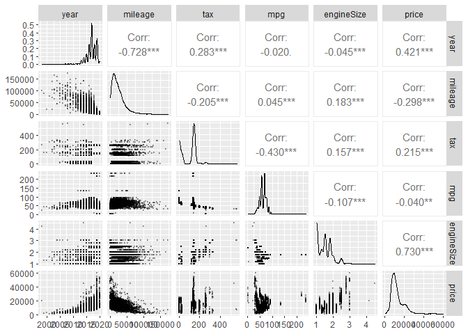

Ayudantia 9 Josefina
================

# Ayudantia 9 Regresion Lineal y Regresion Logistica

## Cargar Librerias

``` r
library(tidyverse)
library(GGally)
library(regclass)
library(pROC)
library(rsample)
```

## Cargar Datos

``` r
 library(readr)
 toyota <- read_csv("C:/Users/josev/Desktop/Ayudantias/Ayudantia 9/toyota.csv")
```

    ## 
    ## -- Column specification --------------------------------------------------------
    ## cols(
    ##   model = col_character(),
    ##   year = col_double(),
    ##   price = col_double(),
    ##   transmission = col_character(),
    ##   mileage = col_double(),
    ##   fuelType = col_character(),
    ##   tax = col_double(),
    ##   mpg = col_double(),
    ##   engineSize = col_double()
    ## )

## Regresion Lineal

# Simple (Precio Auto)

``` r
summary(toyota)
```

    ##     model                year          price       transmission      
    ##  Length:6738        Min.   :1998   Min.   :  850   Length:6738       
    ##  Class :character   1st Qu.:2016   1st Qu.: 8290   Class :character  
    ##  Mode  :character   Median :2017   Median :10795   Mode  :character  
    ##                     Mean   :2017   Mean   :12522                     
    ##                     3rd Qu.:2018   3rd Qu.:14995                     
    ##                     Max.   :2020   Max.   :59995                     
    ##     mileage         fuelType              tax             mpg        
    ##  Min.   :     2   Length:6738        Min.   :  0.0   Min.   :  2.80  
    ##  1st Qu.:  9446   Class :character   1st Qu.:  0.0   1st Qu.: 55.40  
    ##  Median : 18513   Mode  :character   Median :135.0   Median : 62.80  
    ##  Mean   : 22857                      Mean   : 94.7   Mean   : 63.04  
    ##  3rd Qu.: 31064                      3rd Qu.:145.0   3rd Qu.: 69.00  
    ##  Max.   :174419                      Max.   :565.0   Max.   :235.00  
    ##    engineSize   
    ##  Min.   :0.000  
    ##  1st Qu.:1.000  
    ##  Median :1.500  
    ##  Mean   :1.471  
    ##  3rd Qu.:1.800  
    ##  Max.   :4.500

``` r
toyota %>% head()
```

    ## # A tibble: 6 x 9
    ##   model  year price transmission mileage fuelType   tax   mpg engineSize
    ##   <chr> <dbl> <dbl> <chr>          <dbl> <chr>    <dbl> <dbl>      <dbl>
    ## 1 GT86   2016 16000 Manual         24089 Petrol     265  36.2          2
    ## 2 GT86   2017 15995 Manual         18615 Petrol     145  36.2          2
    ## 3 GT86   2015 13998 Manual         27469 Petrol     265  36.2          2
    ## 4 GT86   2017 18998 Manual         14736 Petrol     150  36.2          2
    ## 5 GT86   2017 17498 Manual         36284 Petrol     145  36.2          2
    ## 6 GT86   2017 15998 Manual         26919 Petrol     260  36.2          2

Este dataset contiene informacion sobre el modelo del auto, año, precio,
transmision, kilometraje, mpg (millas por galon), tipo de combustible,
impuesto de circulacion, y tamaño del motor. (La data ya esta limpiada
en cuanto a datos duplicados y columnas relevantes).

En este analisis lo que buscaremos es predecir el precio al que
podriamos vender mi auto en caso de tener un toyora en UK.

Para esto transformamos las variables del modelo, transmision y tipo de
combustible, a factores para trabajar con dichos valores como
“etiquetas”

``` r
toyota$model <- as.factor(toyota$model)
toyota$transmission <- as.factor(toyota$transmission)
toyota$fuelType <- as.factor(toyota$fuelType)

summary(toyota)
```

    ##      model           year          price          transmission 
    ##  Yaris  :2122   Min.   :1998   Min.   :  850   Automatic:2657  
    ##  Aygo   :1961   1st Qu.:2016   1st Qu.: 8290   Manual   :3826  
    ##  Auris  : 712   Median :2017   Median :10795   Other    :   1  
    ##  C-HR   : 479   Mean   :2017   Mean   :12522   Semi-Auto: 254  
    ##  RAV4   : 473   3rd Qu.:2018   3rd Qu.:14995                   
    ##  Corolla: 267   Max.   :2020   Max.   :59995                   
    ##  (Other): 724                                                  
    ##     mileage         fuelType         tax             mpg        
    ##  Min.   :     2   Diesel: 503   Min.   :  0.0   Min.   :  2.80  
    ##  1st Qu.:  9446   Hybrid:2043   1st Qu.:  0.0   1st Qu.: 55.40  
    ##  Median : 18513   Other : 105   Median :135.0   Median : 62.80  
    ##  Mean   : 22857   Petrol:4087   Mean   : 94.7   Mean   : 63.04  
    ##  3rd Qu.: 31064                 3rd Qu.:145.0   3rd Qu.: 69.00  
    ##  Max.   :174419                 Max.   :565.0   Max.   :235.00  
    ##                                                                 
    ##    engineSize   
    ##  Min.   :0.000  
    ##  1st Qu.:1.000  
    ##  Median :1.500  
    ##  Mean   :1.471  
    ##  3rd Qu.:1.800  
    ##  Max.   :4.500  
    ## 

Podemos ver que un valor en el tamaño del motor de 0 no tiene mucho
sentido por lo que revisaremos cuantas observaciones presentan este este
valor, y en caso de haber datos con valor 0 los eliminamos de nuestro
dataset Corroboramos la existencia de valores na y nulos para ver si es
necesario hacer esa limpieza.

``` r
toyota %>% filter(engineSize == 0) %>% nrow()
```

    ## [1] 6

``` r
toyota <- toyota %>%  filter(engineSize != 0)

summary(toyota)
```

    ##      model           year          price          transmission 
    ##  Yaris  :2120   Min.   :1998   Min.   :  850   Automatic:2656  
    ##  Aygo   :1958   1st Qu.:2016   1st Qu.: 8290   Manual   :3821  
    ##  Auris  : 712   Median :2017   Median :10795   Other    :   1  
    ##  C-HR   : 478   Mean   :2017   Mean   :12524   Semi-Auto: 254  
    ##  RAV4   : 473   3rd Qu.:2018   3rd Qu.:14995                   
    ##  Corolla: 267   Max.   :2020   Max.   :59995                   
    ##  (Other): 724                                                  
    ##     mileage         fuelType         tax              mpg        
    ##  Min.   :     2   Diesel: 503   Min.   :  0.00   Min.   :  2.80  
    ##  1st Qu.:  9448   Hybrid:2041   1st Qu.:  0.00   1st Qu.: 55.40  
    ##  Median : 18516   Other : 105   Median :135.00   Median : 62.80  
    ##  Mean   : 22861   Petrol:4083   Mean   : 94.69   Mean   : 63.04  
    ##  3rd Qu.: 31061                 3rd Qu.:145.00   3rd Qu.: 69.00  
    ##  Max.   :174419                 Max.   :565.00   Max.   :235.00  
    ##                                                                  
    ##    engineSize   
    ##  Min.   :1.000  
    ##  1st Qu.:1.000  
    ##  Median :1.500  
    ##  Mean   :1.473  
    ##  3rd Qu.:1.800  
    ##  Max.   :4.500  
    ## 

``` r
sum(is.na(toyota))
```

    ## [1] 0

``` r
sum(is.null(toyota))
```

    ## [1] 0

Una vez ya listo nuestro datos, realizamos una visualizacion de nuestro
datos numericos, para ver la correlacion que pueda existir entre las
variables y la distribucion de los datos.

Podemos observar como las variables del tamaño del motor y el año del
auto tienen una correlación importante y positiva con respecto al
precio. Estas podrían ser las variables que mas expliquen la
distribución de éste.

``` r
toyota %>% select(year, mileage, tax, mpg, engineSize, price) %>% 
  ggpairs(lower = list(continuous = wrap("points", alpha = 0.3, size = 0.5)))
```

<!-- -->

Revisamos como se distribuyen los datos que pasamos a factor en relacion
al precio, para esto utilizamos los boxplot lo que tambien nos ayudara a
ver si existen valores atipicos que puedan alterar nuestro modelo.

Del primer gráfico podemos observar como en el caso de la variable
trasmisión, la del tipo automatico tiene la media sobre el resto de los
tipos de trasmisiones, encontrandonos también con varios datos atipicos,
al igual que en Semi auto.

Del segundo grafico se puede inferir es que el motor tipo hibrido es el
que tiene la media de precios mas alto, pero los autos de precios mas
elevados son de motor tipo diesel, se puede notar en los outliers, como
tambien en el caso del motor tipo otros.

Del útlimo grafico se puede observar que el modelo con rango de precios
mas altos por lejos es el SUPRA.

``` r
toyota %>% 
  ggplot(aes(transmission, price)) +
  geom_boxplot()
```

<!-- -->

``` r
toyota %>% 
  ggplot(aes(fuelType, price)) +
  geom_boxplot()
```

<!-- -->

``` r
toyota %>% mutate(model = reorder(model, price)) %>%
  ggplot(aes(price, model)) +
  geom_boxplot()
```

<!-- -->

Graficamos las cuatro variables con mayores valores (no consideramos los
tax) para ver como se distributen con el precio

``` r
toyota %>% ggplot(aes(mileage, price)) +
  geom_point(alpha = .1) +
  stat_smooth(method = "gam", formula = y ~ s(x, k=3))
```

<!-- -->

``` r
toyota %>% ggplot(aes(year, price)) +
  geom_point(alpha = .1) +
  stat_smooth(method = "gam", formula = y ~ s(x, k=3))
```

<!-- -->

``` r
toyota %>% ggplot(aes(mpg, price)) +
  geom_point(alpha = .1) +
  stat_smooth(method = "gam", formula = y ~ s(x, k=3))
```

<!-- -->

``` r
toyota %>% ggplot(aes(engineSize, price)) +
  geom_point(alpha = .1) +
  stat_smooth(method = "gam", formula = y ~ s(x, k=3))
```

<!-- -->

``` r
toyota %>% filter(., year >= 2005) %>% ggplot(aes(year, price)) +
  geom_point(alpha = .1) +
  stat_smooth(method = "gam", formula = y ~ s(x, k=3))
```

<!-- -->

Escalamos los datos antes de ralizar el analisis de regresion

``` r
toyota_sca <- toyota
toyota_sca[,c(2,3,5,7,8,9)] <- scale(toyota_sca[,c(2,3,5,7,8,9)])

toyota_sca %>%  head()
```

    ## # A tibble: 6 x 9
    ##   model   year price transmission mileage fuelType   tax   mpg engineSize
    ##   <fct>  <dbl> <dbl> <fct>          <dbl> <fct>    <dbl> <dbl>      <dbl>
    ## 1 GT86  -0.339 0.548 Manual        0.0642 Petrol   2.31  -1.69       1.21
    ## 2 GT86   0.115 0.547 Manual       -0.222  Petrol   0.681 -1.69       1.21
    ## 3 GT86  -0.793 0.232 Manual        0.241  Petrol   2.31  -1.69       1.21
    ## 4 GT86   0.115 1.02  Manual       -0.425  Petrol   0.749 -1.69       1.21
    ## 5 GT86   0.115 0.784 Manual        0.702  Petrol   0.681 -1.69       1.21
    ## 6 GT86   0.115 0.547 Manual        0.212  Petrol   2.24  -1.69       1.21

Primero veremos el caso de una regresion simple, donde solo
consideraremos el kilometraje para predecir el precio de nuesto vhiculo

``` r
reg_simp <- lm(price ~ mileage, data = toyota)
summary(reg_simp)
```

    ## 
    ## Call:
    ## lm(formula = price ~ mileage, data = toyota)
    ## 
    ## Residuals:
    ##    Min     1Q Median     3Q    Max 
    ## -10013  -4437  -1910   2991  46188 
    ## 
    ## Coefficients:
    ##               Estimate Std. Error t value Pr(>|t|)    
    ## (Intercept)  1.479e+04  1.151e+02  128.50   <2e-16 ***
    ## mileage     -9.901e-02  3.861e-03  -25.64   <2e-16 ***
    ## ---
    ## Signif. codes:  0 '***' 0.001 '**' 0.01 '*' 0.05 '.' 0.1 ' ' 1
    ## 
    ## Residual standard error: 6059 on 6730 degrees of freedom
    ## Multiple R-squared:  0.08901,    Adjusted R-squared:  0.08888 
    ## F-statistic: 657.6 on 1 and 6730 DF,  p-value: < 2.2e-16

Los resultados de la regresion nos indican que los valores de los
parametros son 0.0001479 para el intercepto y -0.0901 para el
coeficiente asociado a la variable superficie de terreno.

Tambien se puede observar que el coeficiente de determinacion R2 es de
.08901, lo que significa que el 8.9% de la varianza del precio esta
explicada por el modelo lineal.

Veamos que pasa ahora al considerar mas variables en nuestro modelo de
regresion, para eso consideraremos el modelo, el año, su kilometraje, el
tamaño del motor y las millas por galon.

``` r
reg_mult <- lm(price ~ model + year*mileage + engineSize + mpg, data = toyota_sca)
summary(reg_mult)
```

    ## 
    ## Call:
    ## lm(formula = price ~ model + year * mileage + engineSize + mpg, 
    ##     data = toyota_sca)
    ## 
    ## Residuals:
    ##      Min       1Q   Median       3Q      Max 
    ## -2.87872 -0.16417 -0.02289  0.14310  2.91021 
    ## 
    ## Coefficients:
    ##                     Estimate Std. Error t value Pr(>|t|)    
    ## (Intercept)        -0.001391   0.012592  -0.110  0.91207    
    ## modelAvensis       -0.282469   0.031308  -9.022  < 2e-16 ***
    ## modelAygo          -0.327626   0.021985 -14.902  < 2e-16 ***
    ## modelC-HR           0.890092   0.018572  47.927  < 2e-16 ***
    ## modelCamry          0.727859   0.095175   7.648 2.34e-14 ***
    ## modelCorolla        0.713442   0.023484  30.380  < 2e-16 ***
    ## modelGT86           0.573701   0.040290  14.239  < 2e-16 ***
    ## modelHilux          0.426034   0.043258   9.849  < 2e-16 ***
    ## modelIQ             0.110512   0.109436   1.010  0.31262    
    ## modelLand Cruiser   2.503718   0.056755  44.115  < 2e-16 ***
    ## modelPrius          0.703969   0.024537  28.691  < 2e-16 ***
    ## modelPROACE VERSO   1.554445   0.080749  19.250  < 2e-16 ***
    ## modelRAV4           0.308238   0.024964  12.347  < 2e-16 ***
    ## modelSupra          3.976318   0.096118  41.369  < 2e-16 ***
    ## modelUrban Cruiser -0.164767   0.152913  -1.078  0.28129    
    ## modelVerso         -0.081461   0.031494  -2.587  0.00972 ** 
    ## modelVerso-S        0.049601   0.176269   0.281  0.77842    
    ## modelYaris         -0.271531   0.014861 -18.271  < 2e-16 ***
    ## year                0.253938   0.006011  42.249  < 2e-16 ***
    ## mileage            -0.226710   0.005921 -38.288  < 2e-16 ***
    ## engineSize          0.463494   0.010908  42.493  < 2e-16 ***
    ## mpg                 0.057956   0.005039  11.501  < 2e-16 ***
    ## year:mileage       -0.011753   0.002145  -5.478 4.46e-08 ***
    ## ---
    ## Signif. codes:  0 '***' 0.001 '**' 0.01 '*' 0.05 '.' 0.1 ' ' 1
    ## 
    ## Residual standard error: 0.3041 on 6709 degrees of freedom
    ## Multiple R-squared:  0.9078, Adjusted R-squared:  0.9075 
    ## F-statistic:  3004 on 22 and 6709 DF,  p-value: < 2.2e-16

Los resultados de la regresion multiple no muesstra un coeficiente de
determinacion de casi el 91%, y se puede ver que todas las variables son
significativas a excepcion de algunos modelos de autos que no tienen
significancia para nuestro modelo (por lo que podriamos estudiar si
considerar o no esos modelos de audis para nuestro modelo) y la variable
mpg que tampoco es muy significativa.

Revisamos el valor del facto de inflacion de la varianza, este factor
nos permite entender la colinealidad de los datos.

Un VIF por encima de 4 o una tolerancia por debajo de 0,25 indica que
podría existir multicolinealidad y se requiere más investigación.

``` r
VIF(reg_mult)
```

    ##                   GVIF Df GVIF^(1/(2*Df))
    ## model        17.256587 17        1.087379
    ## year          2.629541  1        1.621586
    ## mileage       2.551935  1        1.597478
    ## engineSize    8.659920  1        2.942774
    ## mpg           1.848271  1        1.359511
    ## year:mileage  1.961630  1        1.400582

## Regresion Logistica (AirBnb)

Para el segundo modelo usaremos un data set de distintas variables que
podrian describir la calidad del vino, tales como el pH, la acidez, el
azucar residual, entre otras.

``` r
library(readr)
wine <- read_csv("C:/Users/josev/Desktop/Ayudantias/Ayudantia 9/winequality-red.csv")
```

    ## 
    ## -- Column specification --------------------------------------------------------
    ## cols(
    ##   `fixed acidity` = col_double(),
    ##   `volatile acidity` = col_double(),
    ##   `citric acid` = col_double(),
    ##   `residual sugar` = col_double(),
    ##   chlorides = col_double(),
    ##   `free sulfur dioxide` = col_double(),
    ##   `total sulfur dioxide` = col_double(),
    ##   density = col_double(),
    ##   pH = col_double(),
    ##   sulphates = col_double(),
    ##   alcohol = col_double(),
    ##   quality = col_double()
    ## )

``` r
summary(wine)
```

    ##  fixed acidity   volatile acidity  citric acid    residual sugar  
    ##  Min.   : 4.60   Min.   :0.1200   Min.   :0.000   Min.   : 0.900  
    ##  1st Qu.: 7.10   1st Qu.:0.3900   1st Qu.:0.090   1st Qu.: 1.900  
    ##  Median : 7.90   Median :0.5200   Median :0.260   Median : 2.200  
    ##  Mean   : 8.32   Mean   :0.5278   Mean   :0.271   Mean   : 2.539  
    ##  3rd Qu.: 9.20   3rd Qu.:0.6400   3rd Qu.:0.420   3rd Qu.: 2.600  
    ##  Max.   :15.90   Max.   :1.5800   Max.   :1.000   Max.   :15.500  
    ##    chlorides       free sulfur dioxide total sulfur dioxide    density      
    ##  Min.   :0.01200   Min.   : 1.00       Min.   :  6.00       Min.   :0.9901  
    ##  1st Qu.:0.07000   1st Qu.: 7.00       1st Qu.: 22.00       1st Qu.:0.9956  
    ##  Median :0.07900   Median :14.00       Median : 38.00       Median :0.9968  
    ##  Mean   :0.08747   Mean   :15.87       Mean   : 46.47       Mean   :0.9967  
    ##  3rd Qu.:0.09000   3rd Qu.:21.00       3rd Qu.: 62.00       3rd Qu.:0.9978  
    ##  Max.   :0.61100   Max.   :72.00       Max.   :289.00       Max.   :1.0037  
    ##        pH          sulphates         alcohol         quality     
    ##  Min.   :2.740   Min.   :0.3300   Min.   : 8.40   Min.   :3.000  
    ##  1st Qu.:3.210   1st Qu.:0.5500   1st Qu.: 9.50   1st Qu.:5.000  
    ##  Median :3.310   Median :0.6200   Median :10.20   Median :6.000  
    ##  Mean   :3.311   Mean   :0.6581   Mean   :10.42   Mean   :5.636  
    ##  3rd Qu.:3.400   3rd Qu.:0.7300   3rd Qu.:11.10   3rd Qu.:6.000  
    ##  Max.   :4.010   Max.   :2.0000   Max.   :14.90   Max.   :8.000

``` r
wine %>% head()
```

    ## # A tibble: 6 x 12
    ##   `fixed acidity` `volatile acidity` `citric acid` `residual sugar` chlorides
    ##             <dbl>              <dbl>         <dbl>            <dbl>     <dbl>
    ## 1             7.4               0.7           0                 1.9     0.076
    ## 2             7.8               0.88          0                 2.6     0.098
    ## 3             7.8               0.76          0.04              2.3     0.092
    ## 4            11.2               0.28          0.56              1.9     0.075
    ## 5             7.4               0.7           0                 1.9     0.076
    ## 6             7.4               0.66          0                 1.8     0.075
    ## # ... with 7 more variables: free sulfur dioxide <dbl>,
    ## #   total sulfur dioxide <dbl>, density <dbl>, pH <dbl>, sulphates <dbl>,
    ## #   alcohol <dbl>, quality <dbl>

Primero haremos la regresión logistica utilizando una sola variable, la
cual será el alcohol del vino.

``` r
glimpse(wine)
```

    ## Rows: 1,599
    ## Columns: 12
    ## $ `fixed acidity`        <dbl> 7.4, 7.8, 7.8, 11.2, 7.4, 7.4, 7.9, 7.3, 7.8, 7~
    ## $ `volatile acidity`     <dbl> 0.700, 0.880, 0.760, 0.280, 0.700, 0.660, 0.600~
    ## $ `citric acid`          <dbl> 0.00, 0.00, 0.04, 0.56, 0.00, 0.00, 0.06, 0.00,~
    ## $ `residual sugar`       <dbl> 1.9, 2.6, 2.3, 1.9, 1.9, 1.8, 1.6, 1.2, 2.0, 6.~
    ## $ chlorides              <dbl> 0.076, 0.098, 0.092, 0.075, 0.076, 0.075, 0.069~
    ## $ `free sulfur dioxide`  <dbl> 11, 25, 15, 17, 11, 13, 15, 15, 9, 17, 15, 17, ~
    ## $ `total sulfur dioxide` <dbl> 34, 67, 54, 60, 34, 40, 59, 21, 18, 102, 65, 10~
    ## $ density                <dbl> 0.9978, 0.9968, 0.9970, 0.9980, 0.9978, 0.9978,~
    ## $ pH                     <dbl> 3.51, 3.20, 3.26, 3.16, 3.51, 3.51, 3.30, 3.39,~
    ## $ sulphates              <dbl> 0.56, 0.68, 0.65, 0.58, 0.56, 0.56, 0.46, 0.47,~
    ## $ alcohol                <dbl> 9.4, 9.8, 9.8, 9.8, 9.4, 9.4, 9.4, 10.0, 9.5, 1~
    ## $ quality                <dbl> 5, 5, 5, 6, 5, 5, 5, 7, 7, 5, 5, 5, 5, 5, 5, 5,~

``` r
set.seed(369)
glm.fit <- glm(quality ~ alcohol, data = wine)

summary(glm.fit)
```

    ## 
    ## Call:
    ## glm(formula = quality ~ alcohol, data = wine)
    ## 
    ## Deviance Residuals: 
    ##     Min       1Q   Median       3Q      Max  
    ## -2.8442  -0.4112  -0.1690   0.5166   2.5888  
    ## 
    ## Coefficients:
    ##             Estimate Std. Error t value Pr(>|t|)    
    ## (Intercept)  1.87497    0.17471   10.73   <2e-16 ***
    ## alcohol      0.36084    0.01668   21.64   <2e-16 ***
    ## ---
    ## Signif. codes:  0 '***' 0.001 '**' 0.01 '*' 0.05 '.' 0.1 ' ' 1
    ## 
    ## (Dispersion parameter for gaussian family taken to be 0.5046152)
    ## 
    ##     Null deviance: 1042.17  on 1598  degrees of freedom
    ## Residual deviance:  805.87  on 1597  degrees of freedom
    ## AIC: 3448.1
    ## 
    ## Number of Fisher Scoring iterations: 2

Ahora veremos que tal le va al modelo prediciendo utilizando esta
variable.

``` r
prob <- predict(glm.fit, type ="response")

wine$prob <- prob

curva_roc <- roc(quality ~ prob, data = wine)
```

    ## Warning in roc.default(response, predictors[, 1], ...): 'response' has more
    ## than two levels. Consider setting 'levels' explicitly or using 'multiclass.roc'
    ## instead

    ## Setting levels: control = 3, case = 4

    ## Setting direction: controls < cases

``` r
plot(curva_roc)
```

<!-- -->

``` r
auc(curva_roc)
```

    ## Area under the curve: 0.5726

Podemos ver un AUC (area bajo la curva ROC) de 57%, lo cual es un valor
bastante bajo, no estaría prediciendo muy bien el modelo.

Ahora probaremos con un modelo de regresión logística multivariable.
Seleccioné varias variables que me parecían relevantes

``` r
wine$prob <- NULL

modelo_log_multi <- glm(quality ~ `fixed acidity` + `volatile acidity` + `citric acid` +
                 `residual sugar`  + chlorides + `free sulfur dioxide` + `total sulfur dioxide`+ density + pH +
                        sulphates + alcohol, data = wine)

summary(modelo_log_multi)
```

    ## 
    ## Call:
    ## glm(formula = quality ~ `fixed acidity` + `volatile acidity` + 
    ##     `citric acid` + `residual sugar` + chlorides + `free sulfur dioxide` + 
    ##     `total sulfur dioxide` + density + pH + sulphates + alcohol, 
    ##     data = wine)
    ## 
    ## Deviance Residuals: 
    ##      Min        1Q    Median        3Q       Max  
    ## -2.68911  -0.36652  -0.04699   0.45202   2.02498  
    ## 
    ## Coefficients:
    ##                          Estimate Std. Error t value Pr(>|t|)    
    ## (Intercept)             2.197e+01  2.119e+01   1.036   0.3002    
    ## `fixed acidity`         2.499e-02  2.595e-02   0.963   0.3357    
    ## `volatile acidity`     -1.084e+00  1.211e-01  -8.948  < 2e-16 ***
    ## `citric acid`          -1.826e-01  1.472e-01  -1.240   0.2150    
    ## `residual sugar`        1.633e-02  1.500e-02   1.089   0.2765    
    ## chlorides              -1.874e+00  4.193e-01  -4.470 8.37e-06 ***
    ## `free sulfur dioxide`   4.361e-03  2.171e-03   2.009   0.0447 *  
    ## `total sulfur dioxide` -3.265e-03  7.287e-04  -4.480 8.00e-06 ***
    ## density                -1.788e+01  2.163e+01  -0.827   0.4086    
    ## pH                     -4.137e-01  1.916e-01  -2.159   0.0310 *  
    ## sulphates               9.163e-01  1.143e-01   8.014 2.13e-15 ***
    ## alcohol                 2.762e-01  2.648e-02  10.429  < 2e-16 ***
    ## ---
    ## Signif. codes:  0 '***' 0.001 '**' 0.01 '*' 0.05 '.' 0.1 ' ' 1
    ## 
    ## (Dispersion parameter for gaussian family taken to be 0.4199185)
    ## 
    ##     Null deviance: 1042.17  on 1598  degrees of freedom
    ## Residual deviance:  666.41  on 1587  degrees of freedom
    ## AIC: 3164.3
    ## 
    ## Number of Fisher Scoring iterations: 2

Acontinuación mediremos su desempeño nuevamente viendo su curva ROC y el
AUC.

``` r
prob_multi <- predict(modelo_log_multi, type = c("response"))

wine$prob_multi <- prob_multi

curva_roc_multi <- roc(quality ~ prob_multi, data = wine)
```

    ## Warning in roc.default(response, predictors[, 1], ...): 'response' has more
    ## than two levels. Consider setting 'levels' explicitly or using 'multiclass.roc'
    ## instead

    ## Setting levels: control = 3, case = 4

    ## Setting direction: controls < cases

``` r
plot(curva_roc_multi)
```

<!-- -->

``` r
auc(curva_roc_multi)
```

    ## Area under the curve: 0.7509

Ahora el modelo tiene un AUC del 75%, lo que es bastante mas alto que el
anterior, pero todavia no llega a ser significativo.

Probaremos con un set de entrenamiento y un set de prueba para ver que
tal el desempeño del modelo.

``` r
set.seed(369)

data_split <- initial_split(wine,
                            prop = 0.7,
                            strata = NULL)

train_data <- training(data_split) %>% as.data.frame() 
test_data <- testing(data_split) %>%  as.data.frame()

modelo_log_multi1 <- glm(quality ~ `fixed acidity` + `volatile acidity` + `citric acid` +
                 `residual sugar`  + chlorides + `free sulfur dioxide` + `total sulfur dioxide`+ density + pH +
                        sulphates + alcohol, data = wine)

summary(modelo_log_multi1)
```

    ## 
    ## Call:
    ## glm(formula = quality ~ `fixed acidity` + `volatile acidity` + 
    ##     `citric acid` + `residual sugar` + chlorides + `free sulfur dioxide` + 
    ##     `total sulfur dioxide` + density + pH + sulphates + alcohol, 
    ##     data = wine)
    ## 
    ## Deviance Residuals: 
    ##      Min        1Q    Median        3Q       Max  
    ## -2.68911  -0.36652  -0.04699   0.45202   2.02498  
    ## 
    ## Coefficients:
    ##                          Estimate Std. Error t value Pr(>|t|)    
    ## (Intercept)             2.197e+01  2.119e+01   1.036   0.3002    
    ## `fixed acidity`         2.499e-02  2.595e-02   0.963   0.3357    
    ## `volatile acidity`     -1.084e+00  1.211e-01  -8.948  < 2e-16 ***
    ## `citric acid`          -1.826e-01  1.472e-01  -1.240   0.2150    
    ## `residual sugar`        1.633e-02  1.500e-02   1.089   0.2765    
    ## chlorides              -1.874e+00  4.193e-01  -4.470 8.37e-06 ***
    ## `free sulfur dioxide`   4.361e-03  2.171e-03   2.009   0.0447 *  
    ## `total sulfur dioxide` -3.265e-03  7.287e-04  -4.480 8.00e-06 ***
    ## density                -1.788e+01  2.163e+01  -0.827   0.4086    
    ## pH                     -4.137e-01  1.916e-01  -2.159   0.0310 *  
    ## sulphates               9.163e-01  1.143e-01   8.014 2.13e-15 ***
    ## alcohol                 2.762e-01  2.648e-02  10.429  < 2e-16 ***
    ## ---
    ## Signif. codes:  0 '***' 0.001 '**' 0.01 '*' 0.05 '.' 0.1 ' ' 1
    ## 
    ## (Dispersion parameter for gaussian family taken to be 0.4199185)
    ## 
    ##     Null deviance: 1042.17  on 1598  degrees of freedom
    ## Residual deviance:  666.41  on 1587  degrees of freedom
    ## AIC: 3164.3
    ## 
    ## Number of Fisher Scoring iterations: 2

``` r
test_data$prob_multi <- predict(modelo_log_multi1, test_data, type = c("response"))
auc(roc(quality ~ prob_multi, data = test_data))
```

    ## Warning in roc.default(response, predictors[, 1], ...): 'response' has more
    ## than two levels. Consider setting 'levels' explicitly or using 'multiclass.roc'
    ## instead

    ## Setting levels: control = 3, case = 4

    ## Setting direction: controls < cases

    ## Area under the curve: 0.6042

Ahora el AUC es de 60%, lo que es nuevamente, bastante bajo.

Habría que probar eliminando algunas variables que quizas no sirven para
predecir la calidad del vino, quizas con la ayuda de un experto.
